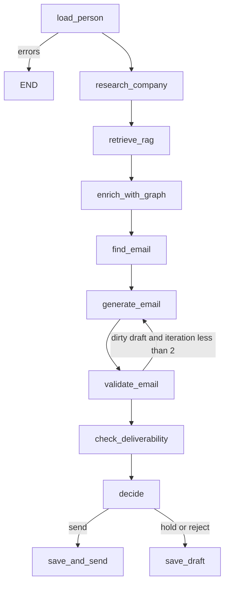

# Outreach AI Cortex

B2B outreach platform with AI agents. FastAPI + PostgreSQL + ChromaDB, all in Docker Compose.

## Stack

- Python 3.12, FastAPI, SQLAlchemy 2.0 (async), Alembic
- PostgreSQL 16, ChromaDB, Neo4j 5 (Bolt), Langfuse (self-hosted, optional keys)
- Docker Compose (no Kubernetes)
- React + Vite UI on **http://localhost:3000** (nginx in Compose; API via `/api` proxy)

## Quick start

```bash
cp .env.example .env
docker compose build
docker compose up -d
docker compose exec api poetry run alembic upgrade head
curl http://localhost:8080/api/v1/health
# UI: http://localhost:3000
```

## UI

React dashboard (Vite + Tailwind + `react-force-graph-2d`): [frontend/README.md](frontend/README.md).

| Path | Page |
|------|------|
| http://localhost:3000/dashboard | Graph node counts + recent companies |
| http://localhost:3000/companies | Create / research |
| http://localhost:3000/persons | LinkedIn research |
| http://localhost:3000/persons/:id | Person detail + email candidates |
| http://localhost:3000/graph?domain=stripe.com | Force-directed network |
| http://localhost:3000/warm-intro | Sender UUID → uncontacted paths at a domain |
| http://localhost:3000/warmup | Mailbox warmup emulator (reputation / ticks) |

### Warm Intro Paths

`GET /api/v1/graph/warm-intro/search` ranks people at the target company who have **no** `EmailThread` yet. UI cards show hop count, path chips, mutuals, and influence. Company detail also lists **Recommended targets** (uncontacted + connection count) and an **influence** badge per person.

The outreach agent node `enrich_with_graph` copies those signals into `graph_context`. If a named mutual exists, generation uses `USER_PROMPT_WITH_WARM_INTRO` (see [PROMPTS.md](PROMPTS.md)). Capture screenshots of `/warm-intro` and the recommended-targets card for the portfolio.

Capture screenshots from those URLs for the portfolio. Browser talks to `/api/v1/...` on the same origin (nginx or Vite proxy), not to `:8080` directly.

## API endpoints

Base URL: `http://localhost:8080/api/v1`

### Health

| Method | Path | Description |
|--------|------|-------------|
| GET | `/health` | PostgreSQL + ChromaDB + LLM config (no token spend) |

### Companies

| Method | Path | Status | Description |
|--------|------|--------|-------------|
| POST | `/companies/` | 201, 409 | Create company (domain unique) |
| GET | `/companies/` | 200 | Paginated list (`limit`, `offset`) |
| GET | `/companies/{domain}` | 200, 404 | Get by domain |
| PATCH | `/companies/{domain}` | 200, 404, 409 | Partial update |
| DELETE | `/companies/{domain}` | 204, 404 | Delete company |
| POST | `/companies/{domain}/research` | 200, 404, 502 | Parse site, save `raw_site_text`, index RAG chunks |
| GET | `/companies/{domain}/context` | 200, 404, 502 | Semantic search (`q`, `top_k`) over indexed chunks |

Example:

```bash
curl -s -X POST http://localhost:8080/api/v1/companies/ \
  -H "Content-Type: application/json" \
  -d '{"domain":"https://www.acme.com/about","name":"Acme","industry":"SaaS","size":"small"}'

curl -s http://localhost:8080/api/v1/companies/acme.com
curl -s "http://localhost:8080/api/v1/companies/?limit=20&offset=0"
curl -s -X PATCH http://localhost:8080/api/v1/companies/acme.com \
  -H "Content-Type: application/json" \
  -d '{"industry":"Fintech"}'
curl -s -o /dev/null -w "%{http_code}\n" -X DELETE http://localhost:8080/api/v1/companies/acme.com
```

`domain` is normalized: scheme, `www.`, path and port are stripped; stored as `acme.com`.

### Persons

| Method | Path | Status | Description |
|--------|------|--------|-------------|
| POST | `/persons/` | 201, 404, 409 | Create person (unique `linkedin_url` / `email`) |
| GET | `/persons/` | 200 | Paginated list (`limit`, `offset`, optional `company_id`) |
| GET | `/persons/{person_id}` | 200, 404 | Get with nested `company` |
| PATCH | `/persons/{person_id}` | 200, 404, 409 | Partial update |
| DELETE | `/persons/{person_id}` | 204, 404 | Delete person (drafts CASCADE) |
| POST | `/persons/{person_id}/company` | 200, 404 | Bind to an existing company |
| POST | `/persons/research` | 200, 400, 404, 422, 502 | Enrich from LinkedIn URL (mock or Phantombuster) |
| POST | `/persons/{person_id}/generate-email` | 200, 400, 404, 502 | RAG + LLM draft, save EmailDraft |
| POST | `/agent/outreach` | 200, 502 | LangGraph: research → find_email → generate → decide |
| GET | `/agent/runs` | 200 | Agent run history (`person_id`, `limit`, `offset`) |

### Email Finder

Pattern guesses + optional Hunter.io. **No live SMTP RCPT** (`SMTP_VERIFICATION_ENABLED=false`). Notes: [research/email-finding-strategies.md](research/email-finding-strategies.md). UI: `/persons/:id`.

| Method | Path | Description |
|--------|------|-------------|
| POST | `/email/find` | Generate/save candidates for `person_id` |
| GET | `/email/candidates/{person_id}` | All guesses, highest confidence first |
| POST | `/email/candidates/{id}/set-primary` | Mark primary and copy onto `Person.email` |
| POST | `/email/candidates/{id}/verify` | Mock SMTP status |
| DELETE | `/email/candidates/{id}` | 204 |

```bash
curl -s -X POST http://localhost:8080/api/v1/email/find \
  -H "Content-Type: application/json" \
  -d '{"person_id":"{person_id}","use_hunter":true,"use_smtp":false}'
```

Capture the candidates list on `/persons/:id` (source badges, confidence, PRIMARY) for the portfolio.

### Email drafts

| Method | Path | Status | Description |
|--------|------|--------|-------------|
| POST | `/email-drafts/` | 201, 404 | Create draft (`person_id` must exist) |
| GET | `/email-drafts/` | 200 | Paginated list (optional `person_id`) |
| GET | `/email-drafts/{draft_id}` | 200, 404 | Get with nested `person` |
| PATCH | `/email-drafts/{draft_id}` | 200, 404 | Partial update |
| DELETE | `/email-drafts/{draft_id}` | 204, 404 | Delete draft |
| POST | `/email-drafts/{draft_id}/mark-sent` | 200, 404 | Set `is_sent=true`, `sent_at=now(UTC)` |

### Deliverability (domain health)

Resource is named by capability, not table name: `/deliverability`.

Live DNS (SPF / DKIM / DMARC / MX) is `GET /deliverability/check/{domain}` — register **before** `GET /{domain}` so `check` is not treated as a domain name.

| Method | Path | Status | Description |
|--------|------|--------|-------------|
| POST | `/deliverability/` | 201 or 200 | Upsert by domain (create / replace) |
| GET | `/deliverability/` | 200 | Paginated list |
| GET | `/deliverability/check/{domain}` | 200 | Live DNS report + score (`save=true` upserts `domain_health`) |
| GET | `/deliverability/{domain}` | 200, 404 | Get stored snapshot |
| PATCH | `/deliverability/{domain}` | 200, 404, 409 | Partial update |
| DELETE | `/deliverability/{domain}` | 204, 404 | Delete snapshot |

```bash
curl -s "http://localhost:8080/api/v1/deliverability/check/gmail.com" | python -m json.tool
docker compose exec api poetry run python /app/tools/deliverability_cli.py gmail.com
```

CLI example:

```
┌ Deliverability Report: gmail.com ─┐
│ Check │ Status    │ Details      │
│ SPF   │ Valid     │ policy=…     │
│ DKIM  │ Valid     │ selector=…   │
│ DMARC │ Valid     │ policy=reject│
│ MX    │ Valid     │ provider=google │
Score: …/100   Risk: low
```

Notes: [research/email-deliverability-2024.md](research/email-deliverability-2024.md). Nested env: `DELIVERABILITY_DNS_TIMEOUT`, `DELIVERABILITY_CACHE_TTL_SECONDS`. In-process TTL cache is per container, not shared across replicas.

The LangGraph node still uses `app.services.deliverability_checker.DeliverabilityChecker` (DB snapshot). Live DNS lives in `app.services.deliverability.checker`.

### Warmup (mailbox emulator)

Simulated engagement against a fake peer network. **No SMTP.** One `tick` = one warmup day. In-process scheduler is off (`WARMUP_AUTO_RUN_ENABLED=false`); drive ticks from the UI, curl, or n8n (`n8n/workflows/warmup_tick.json`).

| Method | Path | Description |
|--------|------|-------------|
| POST | `/warmup/mailboxes` | Create mailbox (`NEW`, reputation 50) |
| GET | `/warmup/mailboxes` | List (`status`, `limit`, `offset`) |
| GET | `/warmup/mailboxes/{id}` | Detail + computed rates |
| DELETE | `/warmup/mailboxes/{id}` | 204 |
| POST | `/warmup/mailboxes/{id}/start` | `WARMING`, day=1 |
| POST | `/warmup/mailboxes/{id}/pause` | Pause |
| POST | `/warmup/mailboxes/{id}/resume` | Resume (409 if banned) |
| POST | `/warmup/mailboxes/{id}/tick` | One simulated day |
| POST | `/warmup/tick-all` | All `WARMING` (403 unless `DEBUG` or `X-Admin-Token`) |
| GET | `/warmup/mailboxes/{id}/stats` | Rates + reputation |
| GET | `/warmup/mailboxes/{id}/events` | Recent events |
| GET | `/warmup/mailboxes/{id}/timeline` | Per-day sent/opened/replied |

```bash
docker compose exec api poetry run alembic upgrade head
curl -s -X POST http://localhost:8080/api/v1/warmup/mailboxes \
  -H "Content-Type: application/json" \
  -d '{"email":"sender@yourdomain.com","display_name":"Kirill"}'
```

Notes: [research/warmup-mechanics.md](research/warmup-mechanics.md). UI: `/warmup` and `/warmup/:id` (bar chart of volume vs opens).


## Migrations

```bash
docker compose exec api poetry run alembic revision --autogenerate -m "describe change"
docker compose exec api poetry run alembic upgrade head
docker compose exec api poetry run alembic current
```

Always review the generated file under `backend/alembic/versions/` before applying.

Day 8 adds `agent_runs` (`e8c0a1b2d3e4`). Apply it after pull:

```bash
docker compose exec api poetry run alembic upgrade head
```

## Site parser

`POST /api/v1/companies/{domain}/research` fetches `https://{domain}` plus a few product/about paths.

- **httpx** — async HTTP (same event loop as FastAPI)
- **trafilatura** — main-content extraction (drops nav/footer chrome)
- **BeautifulSoup + lxml** — title/meta and fallback if trafilatura returns nothing

Text is capped at `PARSER_MAX_TEXT_LENGTH` (default 50_000). Fetch failures are returned in `errors` (HTTP 200); unknown company is 404; unexpected crashes are 502.

```bash
curl -s -X POST http://localhost:8080/api/v1/companies/ \
  -H "Content-Type: application/json" \
  -d '{"domain":"stripe.com","name":"Stripe"}'

curl -s -X POST http://localhost:8080/api/v1/companies/stripe.com/research
```

The research response includes `chunks_indexed` after the site text is split and stored in Chroma.

## RAG (Chroma + cloud embeddings)

No local models. Default `RAG_MODE=mock` hashes chunks into unit vectors so CI works without an API key. `RAG_MODE=real` calls OpenAI `text-embedding-3-small` (or OpenRouter if `RAG_OPENAI_BASE_URL` is set).

- **CompanyTextSplitter** — `RecursiveCharacterTextSplitter` (1000 / 200 overlap), drop chunks shorter than 50 chars, cap source at 1M chars
- **RAGService** — delete + recreate `company_{domain}`, cosine HNSW, `tiktoken` token estimate
- **GET** `/api/v1/companies/{domain}/context?q=pricing` — top-k semantic search

```bash
curl -s "http://localhost:8080/api/v1/companies/stripe.com/context?q=pricing&top_k=3"
```

Health (`GET /api/v1/health`) pings Chroma through the shared `HttpClient` singleton.

## LinkedIn Integration

The project supports two modes. Default is **mock** so local work needs no third-party keys.

### Mock mode (default)

Deterministic fake profiles from `sha256(username)`. Same URL always yields the same name/title/company. Fine for local dev and pytest.

```
LINKEDIN_MODE=mock
```

```bash
curl -s -X POST http://localhost:8080/api/v1/persons/research \
  -H "Content-Type: application/json" \
  -d '{"linkedin_url":"https://linkedin.com/in/johndoe"}'
```

A second POST with the same URL returns `source=cache` and the same `person.id`.

### Real mode (Phantombuster)

Launches a LinkedIn Profile Scraper phantom and polls `fetch-output`. On HTTP/timeout/empty output the service **falls back to mock** and logs a warning.

```
LINKEDIN_MODE=real
PHANTOMBUSTER_API_KEY=your_key_here
LINKEDIN_PHANTOMBUSTER_PHANTOM_ID=your_agent_id
```

We never scrape LinkedIn from this repo (ToS / legal). Design notes: [research/linkedin-mock-vs-real.md](research/linkedin-mock-vs-real.md).

## Email generation

`POST /api/v1/persons/{person_id}/generate-email` runs: **RAG retrieve → prompt → cloud LLM → validate → save EmailDraft**.

Default `LLM_MODE=mock` returns a deterministic JSON draft so CI spends no tokens. `LLM_MODE=real` calls OpenAI or OpenRouter (`gpt-4o-mini` in dev, `gpt-4o` as `PREMIUM_MODEL`). Sender identity is passed per request, not stored as a user table.

```bash
curl -s -X POST http://localhost:8080/api/v1/persons/{person_id}/generate-email \
  -H "Content-Type: application/json" \
  -d '{
    "person_id": "{person_id}",
    "goal": "meeting",
    "tone": "professional",
    "max_words": 120,
    "language": "en",
    "sender_name": "Kirill",
    "sender_title": "Founder",
    "sender_company": "AI Cortex"
  }'
```

Prompt notes: [research/llm-prompt-engineering-for-outreach.md](research/llm-prompt-engineering-for-outreach.md) · all templates: [PROMPTS.md](PROMPTS.md)

## AI Agent

`POST /api/v1/agent/outreach` runs a **LangGraph** `StateGraph` instead of a single generate call.



| Node | What it does |
|------|----------------|
| `load_person` | Load Person + Company |
| `research_company` | Parse/index the site if `raw_site_text` is empty |
| `retrieve_rag` | Chroma search |
| `enrich_with_graph` | Warm-intro / influence into `graph_context` |
| `find_email` | Pattern + Hunter candidates if `Person.email` is empty (does not block generate) |
| `generate_email` | Cloud LLM (or `LLM_MODE=mock`); prompt includes `{email_hint}` |
| `validate_email` | Spam / CAPS / forbidden phrases |
| `check_deliverability` | SPF+DKIM snapshot for the sending domain |
| `decide` | `send` / `hold` / `reject` |
| `save_draft` | Persist for audit (including rejects) |
| `save_and_send` | Save + stub `mark_sent` (SMTP in Day 10) |

Default `AGENT_REQUIRE_HUMAN_APPROVAL=true` so a clean draft still **holds**. Set it `false` only when you intend auto-send. `send_email` is a stub — no SMTP yet.

```bash
curl -s -X POST http://localhost:8080/api/v1/agent/outreach \
  -H "Content-Type: application/json" \
  -d '{
    "person_id": "{person_id}",
    "goal": "meeting",
    "sender_name": "Kirill",
    "sender_title": "Founder",
    "sender_company": "AI Cortex"
  }'

curl -s "http://localhost:8080/api/v1/agent/runs?person_id={person_id}"
```

Mermaid source: [docs/agent_graph.mmd](docs/agent_graph.mmd). Why LangGraph: [research/langgraph-vs-langchain-agents.md](research/langgraph-vs-langchain-agents.md). After `alembic upgrade head`, `agent_runs` stores `final_state` for debugging.

## Observability with Langfuse

Self-hosted UI: **http://localhost:3001** (mapped from container port 3000). Langfuse uses its **own** Postgres (`langfuse-db`), not the app database.

What is traced:

| Event | Where |
|--------|--------|
| LLM `chat()` | generation: system vs user inputs, output, tokens, `cost_usd`, latency |
| Graph nodes | spans (`load_person` … `save_and_send`); `decide` adds `decision`, `decision_reason`, `validation_errors` |
| Agent run | root trace `outreach_agent_{person_id}` + LangChain `CallbackHandler` |
| Email quality | scores: `length_score`, `spam_score`, `personalization_score`, `cta_score` |

Empty `LANGFUSE_PUBLIC_KEY` / `LANGFUSE_SECRET_KEY` → tracing is a **no-op** (API still starts). `LANGFUSE_SAMPLE_RATE=1.0` in dev; drop it (e.g. `0.1`) if the UI or ingest lags.

```bash
docker compose up -d langfuse-db langfuse
# Open http://localhost:3001 → register admin → project "outreach-ai-cortex" → copy keys into .env
docker compose up -d
```

Dashboard capture notes: [docs/langfuse-screenshots/README.md](docs/langfuse-screenshots/README.md). Why LLM observability: [research/langfuse-observability-for-llm.md](research/langfuse-observability-for-llm.md).

RAM budget: `langfuse-db` 256m + `langfuse` 768m. Do not start Langfuse on a machine already near the 4 GB Compose cap if you do not need traces.

## Guardrails

Outbound copy is checked **after** generation, in parallel (`GuardrailPipeline`):

| Rail | Blocks send? |
|------|----------------|
| Hallucination (capitalized tokens vs RAG/person/company) | error if **>3** unknown entities; 1–2 is a warning |
| Content policy (abuse, politics, spam phrasing, URL shorteners) | **critical** abuse terms only |
| PII (phone, extra email, PAN-like digits, US SSN) | error; sender email in `context` is allowed |
| Structure (greeting, CTA, placeholders, length) | missing CTA / leftover `{placeholders}` |

Warnings never set `all_passed=False`. The agent `decide` node rejects on error/critical. One LLM retry with `GUARDRAIL_RETRY_SUFFIX` happens in `EmailGenerator` before giving up.

JSON: `email_drafts.guardrail_results`. Apply `f1a2b3c4d5e6` (`alembic upgrade head`).

## Analytics

Read-only SQL under `/api/v1/analytics`:

| Path | Source |
|------|--------|
| `GET /costs/summary?days=7` | `agent_runs` |
| `GET /costs/by-model` | `email_drafts.generation_context.model` |
| `GET /quality/scores` | JSONB quality_scores |
| `GET /guardrails/failures` | `guardrail_results` |
| `GET /agent/decisions` | `agent_runs.decision` |

Investor-facing: **cost per run**, **send/hold/reject mix**, **personalization_score** — not token vanity charts.

## Graph Database (Neo4j)

Bolt UI: **http://localhost:7474** (`bolt://localhost:7687`). Heap max **512m**, pagecache **256m**, container `mem_limit` **1024m**. Postgres remains CRUD source of truth; Neo4j is a path/index.

### Graph Use Cases

| Use case | Endpoint |
| --- | --- |
| Shortest intro path | `GET /api/v1/graph/path?from_person_id=&to_person_id=` |
| Path into an account | `GET /api/v1/graph/person/{id}/path-to-company?company_domain=` |
| Mutual connections (two people) | `GET /api/v1/graph/persons/mutual?person_a_id=&person_b_id=` |
| Friends already at the account | `GET /api/v1/graph/person/{id}/mutual-connections?target_company_domain=` |
| Influence score | `GET /api/v1/graph/person/{id}/influence` |
| Org + neighbors | `GET /api/v1/graph/company/{domain}/network?depth=2` |
| Decision-makers | `GET /api/v1/graph/company/{domain}/decision-makers` |
| Recommended uncontacted targets | `GET /api/v1/graph/company/{domain}/recommended-targets` |
| Competitors | `GET/POST /api/v1/graph/company/{domain}/competitors` |
| Warm intro paths | `GET /api/v1/graph/person/{id}/warm-intro-paths?target_company_domain=` |
| Warm intro search (sender → account) | `GET /api/v1/graph/warm-intro/search?sender_person_id=&target_company_domain=` |
| Graph stats / rankings | `GET /api/v1/graph/analytics/stats`, `.../top-influencers`, `.../company-rankings` |

Capture a Browser screenshot (`MATCH (n) RETURN n LIMIT 25`) for interviews. Patterns: [research/graph-query-patterns.md](research/graph-query-patterns.md). Recipes: [docs/graph-recipes.md](docs/graph-recipes.md). Warm intro ranking: [research/warm-intro-path-finding.md](research/warm-intro-path-finding.md). Why Neo4j vs CTE: [research/neo4j-vs-postgresql-graph-queries.md](research/neo4j-vs-postgresql-graph-queries.md). Schema: `get_schema_description()` in `backend/app/services/graph/schema.py`.

```bash
docker compose up -d neo4j
docker compose exec neo4j cypher-shell -u neo4j -p "$NEO4J_PASSWORD" "RETURN 1;"
docker compose exec api poetry run python -m scripts.sync_to_neo4j
docker stats outreach-neo4j   # stay under ~1 GB
```

`POST /api/v1/graph/sync` needs header `X-Admin-Token: $GRAPH_SYNC_TOKEN` (or `DEBUG=true` with empty token). `NEO4J_AUTO_SYNC_ON_WRITE=false` by default so CRUD tests do not open Bolt.

## Docs

- Swagger UI: http://localhost:8080/docs
- ReDoc: http://localhost:8080/redoc
- **Days 1–12 recap (canonical):** [RU](research/days-1-12-summary.ru.md) · [EN](research/days-1-12-summary.en.md)
- Days 1–8 recap: [RU](research/days-1-8-summary.ru.md) · [EN](research/days-1-8-summary.en.md)
- Days 1–5 only: [RU](research/days-1-5-summary.ru.md) · [EN](research/days-1-5-summary.en.md)
- Langfuse observability: [research/langfuse-observability-for-llm.md](research/langfuse-observability-for-llm.md)
- Prompt catalog: [PROMPTS.md](PROMPTS.md)
- Architecture: [docs/ARCHITECTURE.md](docs/ARCHITECTURE.md)
- Days 1–10: [docs/DAY10_SUMMARY.md](docs/DAY10_SUMMARY.md)
- Graph Cypher patterns: [research/graph-query-patterns.md](research/graph-query-patterns.md)
- Graph recipes: [docs/graph-recipes.md](docs/graph-recipes.md)
- Warm intro path finding: [research/warm-intro-path-finding.md](research/warm-intro-path-finding.md)
- Email finding strategies: [research/email-finding-strategies.md](research/email-finding-strategies.md)
- Neo4j vs Postgres graph queries: [research/neo4j-vs-postgresql-graph-queries.md](research/neo4j-vs-postgresql-graph-queries.md)
