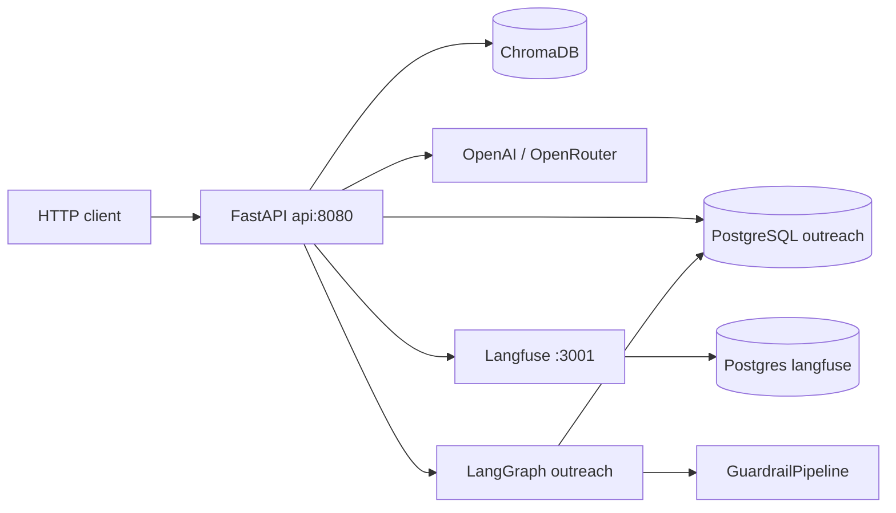

# Architecture — Outreach AI Cortex

Target: 8 GB RAM, Intel Iris Xe. Cloud LLMs only. Docker Compose only (no Kubernetes).

## Components

| Layer | Role |
|-------|------|
| **API** | Thin routers under `/api/v1` — companies, persons, drafts, deliverability, agent, analytics, health |
| **Services** | Site parser, LinkedIn, RAG, `LLMClient`, `EmailGenerator`, `TracingService`, `AnalyticsService` |
| **Models** | SQLAlchemy 2.0 async: Company, Person, EmailDraft, DomainHealth, AgentRun |
| **Agent** | `OutreachState` → 9 nodes, conditional edges, in-process checkpointer by default |
| **Guardrails** | Hallucination (heuristic NER), content policy, PII regex, structure — parallel `asyncio.gather` |
| **Observability** | Langfuse traces/spans/generations/scores; `CostTracker`; analytics SQL |

## Request → email

1. `POST /persons/{id}/generate-email` or `POST /agent/outreach`
2. Load Person + Company; optional research + Chroma retrieve
3. `LLMClient.chat` (retry policy: rate limit / timeout / connection only)
4. `OutputValidator` then `GuardrailPipeline` (one repair generation if blocked)
5. Heuristic `QualityScorer` → Langfuse scores
6. Persist `EmailDraft` (`guardrail_results` JSONB) and optionally `AgentRun`

`thread_id` for LangGraph is `{person_id}:{uuid}` so a second run does not resume a stale checkpoint.

## Choices

- **No local models** — VRAM and RAM budget.
- **Langfuse v2 + separate Postgres** — isolation; API starts with empty keys (no-op tracing).
- **Guardrails return results, not exceptions** — warnings are telemetry; only error/critical block send.
- **Retry with jitter** — avoid thundering herd on 429s; never retry auth/400.
