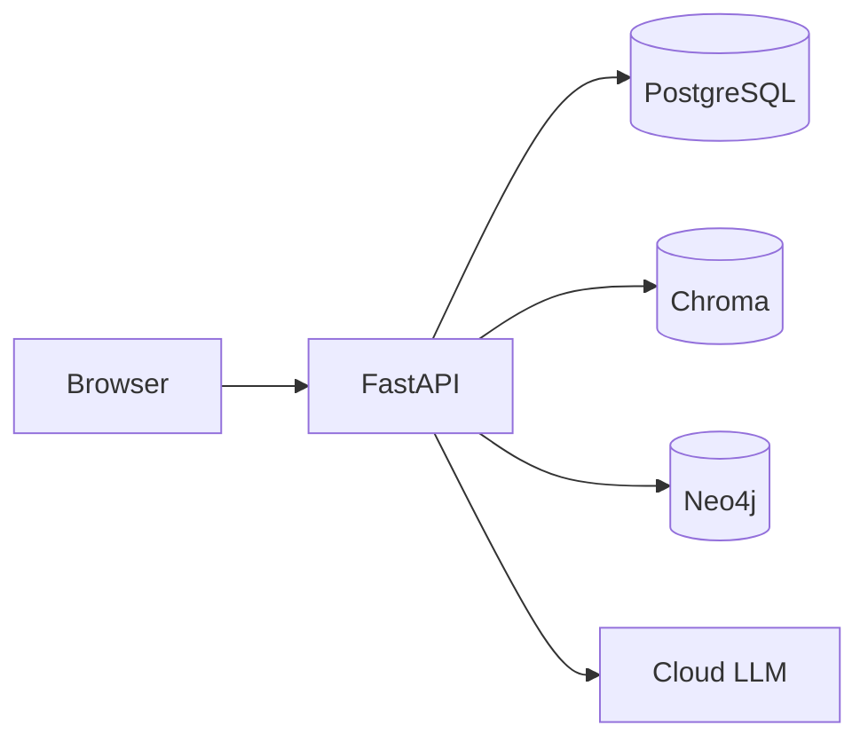

# Architecture — Outreach AI Cortex

Host budget: **8 GB RAM**, Intel Iris Xe (128 MB VRAM). Cloud LLMs only (OpenAI, OpenRouter). Docker Compose is the way this stack runs, including on a VPS ([docs/DEPLOY.md](DEPLOY.md)). Kubernetes, Helm, Minikube, and k3s are not a recommended production path. Local inference (Ollama, transformers, PyTorch, TensorFlow) does not fit the machine and is out of scope.

The UI is nginx on port 3000. It proxies `/api/` to the API on the Compose network. Operators also call the API with curl or Swagger. LangGraph runs inside the API process. Langfuse is optional and uses a second Postgres when profile `extra` is on.

## Layers

| Layer | Role |
|-------|------|
| Routers | Thin HTTP under `/api/v1`: companies, persons, email finder, enrichment, sequences, CRM, articles, deliverability, agent, analytics, graph, warmup, health. `GET /metrics` is at the app root. |
| Services | Parser, RAG, `LLMClient`, email finder, guardrails, CRM clients, article generator, warmup emulator, graph queries. No business rules in routers. |
| Models | SQLAlchemy 2.0 async: Company, Person, EmailDraft, EmailCandidate, DomainHealth, AgentRun, Mailbox, WarmupEvent, OutreachSequence, CrmSyncEvent, SEOArticle. |
| Schemas | Pydantic v2 request and response models. |

## Compose services and RAM

Dev file `docker-compose.yml` (8 GB host): postgres 512m, Chroma 768m, api 512m, frontend 128m, Neo4j 1024m, Langfuse 768m, Langfuse Postgres 256m. Sum of caps is about 4 GB.

Prod file `docker-compose.prod.yml` (1 GB VPS): api 512m, postgres 512m, frontend 64m. Chroma 256m is profile `rag`. Neo4j and Langfuse are profile `extra` and stay off on 1 GB. Postgres is not published on `0.0.0.0`.

## Agent

`OutreachState` graph in `backend/app/services/agent/graph.py`:

`load_person` → `research_company` → `retrieve_rag` → `enrich_with_graph` → `find_email` → `generate_email` → `validate_email` → `check_deliverability` → `decide` → `save_draft` or `save_and_send`.

`require_human_approval` defaults to true, so `decide` returns **hold** (`awaiting approval`). `save_and_send` only marks a row sent in Postgres. It does not open an SMTP session. `find_email` uses pattern guesses plus Hunter/Apollo when those clients are enabled. Default is patterns only.

Guardrails (`pii_detection`, `content_policy`, `hallucination`, `structure`) return results. They do not raise. One repair generation is allowed. `thread_id` is `{person_id}:{uuid}` so a new run does not resume a stale checkpoint.

## What is real and what is mock

| Piece | Default |
|-------|---------|
| LLM and embeddings | `mock` — deterministic, no token spend. `real` calls OpenAI or OpenRouter. |
| LinkedIn / Phantombuster | `mock` from a hash of the profile slug. Real mode calls the API and falls back to mock on errors. This repo does not scrape LinkedIn. |
| Hunter, Apollo | HTTP clients exist. They return nothing unless the flag and API key are set. |
| SMTP RCPT | Off. Verification is a mock status. |
| CRM | `CRM_PROVIDER=mock`. Bitrix24 and retailCRM clients POST only with a webhook or key. |
| Sequences | Instantly-shaped steps, enroll, tick. `emails_sent` stays 0. No live send. |
| Warmup | Emulator over a fake peer network. No SMTP. |
| n8n | JSON in `n8n/workflows/`. Not a Compose service. |
| Articles | Generate and optimize are real code paths (mock LLM by default). Publish target is a mock URL unless a webhook is set. |
| Sentry | Off until `SENTRY_DSN` is set. |
| Langfuse | No-op without keys. |

## Request paths worth remembering

1. `POST /api/v1/companies/{domain}/research` — fetch the public site, store text, index Chroma.
2. `POST /api/v1/persons/research` — mock or Phantombuster profile.
3. `POST /api/v1/email/find` — candidates; primary only at confidence ≥ 0.6.
4. `POST /api/v1/agent/outreach` — the graph above, usually hold.
5. `POST /api/v1/warmup/mailboxes/{id}/tick` — one simulated day.
6. `POST /api/v1/articles/generate` then `POST /api/v1/articles/{id}/optimize`.
7. `POST /api/v1/crm/sync/{person_id}` — mock upsert unless a vendor is configured.

Postgres is the system of record. Neo4j is a query index for warm-intro paths and recommended targets. Sync is batch (`NEO4J_AUTO_SYNC_ON_WRITE=false`).
