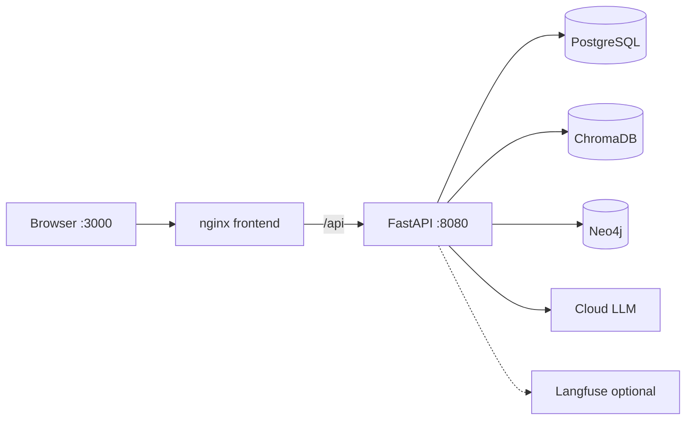
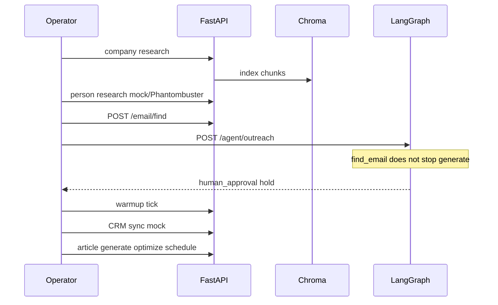

# Как устроен Outreach AI Cortex

Гайд для человека, который знает Kotlin и хочет за четыре минуты понять карту сервисов, сквозной сценарий, запуск и честные границы портфолио. Полная схема слоёв — в [ARCHITECTURE.md](../ARCHITECTURE.md). Сценарий для видео — [DEMO.md](../DEMO.md). VPS — [DEPLOY.md](../DEPLOY.md). Цифры покрытия — [PROJECT_METRICS.md](../PROJECT_METRICS.md).

Железо: **8 ГБ RAM**, Intel Iris Xe. Стек живёт в **Docker Compose**. Kubernetes нет. Локальных LLM (Ollama, PyTorch) нет — только облачные API или моки.

## Elevator (English, interviews)

Outreach AI Cortex is a B2B outreach lab: FastAPI, PostgreSQL, Chroma, Neo4j.

It runs on Docker Compose for an 8 GB laptop. No Kubernetes. No local LLMs.

The browser talks to nginx on port 3000. `/api` is proxied to FastAPI on 8080.

Routers stay thin. Services own research, RAG, LangGraph, CRM, warmup, and articles.

Typical path: index a company site, mock-research a person, guess emails, run the agent.

There is no live SMTP `RCPT TO`. Pattern guesses (and optional Hunter/Apollo) only.

In LangGraph, `find_email` never blocks `generate`. Missing inbox still produces a draft.

`AGENT_REQUIRE_HUMAN_APPROVAL` defaults to true, so `decide` returns hold.

Sequences look Instantly-shaped. They only tick `current_step`. `emails_sent` stays zero.

CRM defaults to `CRM_PROVIDER=mock`. n8n JSON is in git, not a Compose service (RAM).

Without Hunter, Apollo, Phantombuster, or OpenAI keys, mock modes still demo the loop.

Health, CRUD, pattern finder, agent hold, warmup ticks, and article drafts all work.

Postgres is the system of record. Neo4j is a path index, synced in batch.

Langfuse is optional; empty keys make tracing a no-op so the API still boots.

I can talk 12-factor config, same-origin `/api` vs `:8080`, and SOLID if a parser sits in a router.

## 1. Карта блоков



n8n **не** прямоугольник на этой схеме. В репозитории лежат JSON (`n8n/workflows/warmup_tick.json`, `outreach_run.json`, `article_publish.json`). Их импортируют в свой n8n. В `docker-compose.yml` сервиса n8n нет: на 8 ГБ хосте лимит контейнеров уже около 4 ГБ.

В Compose: postgres, chromadb, api, frontend, neo4j, плюс опционально langfuse + langfuse-db. Langfuse слушает **:3001** снаружи (внутри контейнера 3000). Без ключей трейсинг — no-op, API всё равно стартует.

Слои приложения (`backend/app/`):

| Слой | Роль |
|------|------|
| `api/routers/` | HTTP: статус-коды, Depends, Pydantic-ответы. Без парсера и без LLM. |
| `services/` | Исследование сайта, RAG, finder, LangGraph, CRM, warmup, статьи. |
| `models/` | SQLAlchemy 2.0 async. Postgres — источник правды. |
| `schemas/` | Pydantic v2 на границе HTTP. |

SOLID-самопроверка: бизнес не в роутере. Пример: `POST /companies/{domain}/research` только вызывает `CompanyService.research`. Если вызвать парсер (httpx + trafilatura) прямо из роутера, сломается SRP: HTTP-слой начнёт знать таймауты, обрезку текста и Chroma.

Конфиг — 12-factor: `.env` + pydantic-settings, секреты не в коде.

## 2. Сквозной сценарий



1. **Company research.** Создаёте компанию (`stripe.com` в демо), затем `POST /companies/{domain}/research`: публичный сайт → `raw_site_text` → чанки в Chroma. В `RAG_MODE=mock` эмбеддинги — хеш-векторы, без токенов.
2. **Person research.** `POST /persons/research`. По умолчанию `LINKEDIN_MODE=mock`: детерминированный профиль из хеша URL. Реальный режим — Phantombuster API, не скрейп linkedin.com из этого репо. Нет ключа или ошибка HTTP → fallback на mock.
3. **Email find.** `POST /email/find` — паттерны (`first.last`, `flast`, …). Hunter/Apollo — только при флаге и ключе. **Живого SMTP `RCPT TO` нет:** `SMTP_VERIFICATION_ENABLED=false`. Верификатор пишет mock-статус и не открывает MX.
4. **LangGraph** (`POST /agent/outreach`). Цепочка: load_person → research_company → retrieve_rag → enrich_with_graph → find_email → generate → validate → check_deliverability → decide. Ребро `find_email → generate_email` безусловное: нет ящика — generate всё равно идёт с `{email_hint}`. `AGENT_REQUIRE_HUMAN_APPROVAL=true` → **hold** (`awaiting approval`). Черновик сохраняется. `save_and_send` только stub `mark_sent`, SMTP-сессии нет.
5. **Warmup tick.** Эмулятор репутации. Один tick = один симулированный день. Письма в интернет не уходят.
6. **CRM sync.** `CRM_PROVIDER=mock` по умолчанию: строка в `crm_sync_events`, без HTTP в Bitrix/retailCRM.
7. **Статьи.** generate (RAG + LLM или mock) → optimize (детерминированные meta/keywords) → schedule. Публикация — mock URL, пока нет webhook.

Честно про «интеграции»: Sequence — форма кампании в Postgres (`current_step++`, `emails_sent` всегда 0). Это **не** Instantly API и не рассылка.

Deliverability: таблица `DomainHealth` — снимок SPF/DKIM в Postgres; агент читает снимок. `GET /deliverability/check/{domain}` — живой DNS + счёт, опционально `save=true` пишет снимок. Маршрут `check` объявлен **раньше** `/{domain}`, иначе слово `check` стало бы доменом.

## 3. Как запустить

`.env` из примера, файл в git не коммитить (см. `.gitignore`).

```bash
cp .env.example .env
docker compose build && docker compose up -d
docker compose exec api poetry run alembic upgrade head
curl http://localhost:8080/api/v1/health
```

UI: http://localhost:3000. Swagger: http://localhost:8080/docs.

В Compose браузер ходит на **тот же origin**, nginx проксирует `/api/` на `http://api:8080/api/`. Прямой `:8080` из UI сломал бы cookie/CORS и имя сервиса `api` с хоста.

Без ключей Hunter / Apollo / Phantombuster / OpenAI оставьте:

```
LLM_MODE=mock
RAG_MODE=mock
LINKEDIN_MODE=mock
```

Что всё равно работает: health, CRUD компаний и людей, research сайта (публичный HTTP), mock-эмбеддинги в Chroma, mock LinkedIn, паттерны email, агент до **hold**, warmup, CRM mock-строка, статьи generate/optimize/schedule, Sequence tick без отправки. Не работает «как у вендора»: Hunter/Apollo ответы, cloud LLM, Phantombuster people-search, Bitrix HTTP, Langfuse-трейсы без ключей проекта.

## 4. Как проверить

Пошагово — [DEMO.md](../DEMO.md): health → research stripe.com → person → email find → agent hold → warmup tick → article generate+optimize.

Тесты с корня репозитория (`pythonpath = ["backend"]` в `pyproject.toml`):

```bash
pytest -q
```

Интеграционные фикстуры бьют в `http://127.0.0.1:8080`. В `backend/tests/conftest.py` `api_client` делает health; при `httpx.HTTPError` — **skip**, а не красный прогон без Docker.

Фронт: `cd frontend && npm test && npm run build`, если есть Node. Иначе смотрите CI: https://github.com/KirillUnity/outreach-ai-corte/actions на ветке **main**.

## 5. Чеклист портфолио (по факту репо)

| Пункт | Да/нет | Как проверено |
|-------|--------|----------------|
| `.env` не в git | **да** | `.gitignore`: `.env`; `git check-ignore` → ignored; `git ls-files .env` пусто |
| Нет живого RCPT TO | **да** | `.env.example`: `SMTP_VERIFICATION_ENABLED=false`; `SMTPVerifier` не открывает MX |
| Нет обещания «Instantly шлёт письма» | **да** | README/DEMO: Instantly не интегрирован; tick только шаг; `emails_sent=0` |
| README Quick start = порты Compose | **да** | UI **3000**, API **8080**, health `/api/v1/health` — как в `docker-compose.yml` |
| Скрины | **честно** | Есть чеклист [docs/demo/SCREENSHOTS.md](../demo/SCREENSHOTS.md). PNG/GIF в `docs/demo/` в git **нет**; `*.mp4`/`*.mov` в gitignore |

## Проверочные вопросы

1. **Почему n8n не в Compose по умолчанию?** RAM: хост 8 ГБ, сумма `mem_limit` уже ~4 ГБ. n8n — отдельный рантайм; в git только JSON workflow.
2. **Snapshot `DomainHealth` vs `GET /deliverability/check/{domain}`?** Снимок — строка в Postgres для агента. `check` — живой DNS (SPF/DKIM/DMARC/MX) и опциональный upsert.
3. **Зачем hold в dev?** Черновик с галлюцинациями и PII не должен уходить. `save_and_send` не открывает SMTP; hold — явная граница демо.
4. **Почему UI на `/api`, не на `:8080` в Compose?** nginx на :3000 проксирует `/api/` на сервис `api:8080`. Браузер остаётся same-origin.
5. **SOLID, если парсер вызвать из роутера?** Нарушится SRP (и тестируемость): HTTP смешается с fetch/extract/index. Парсер вызывается из `services/`.
