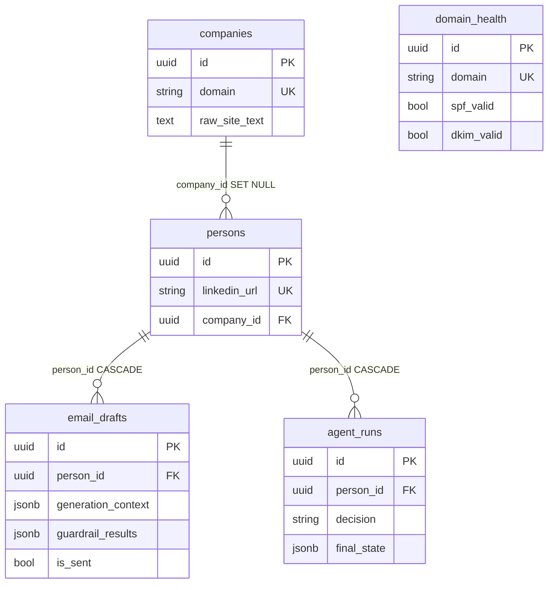
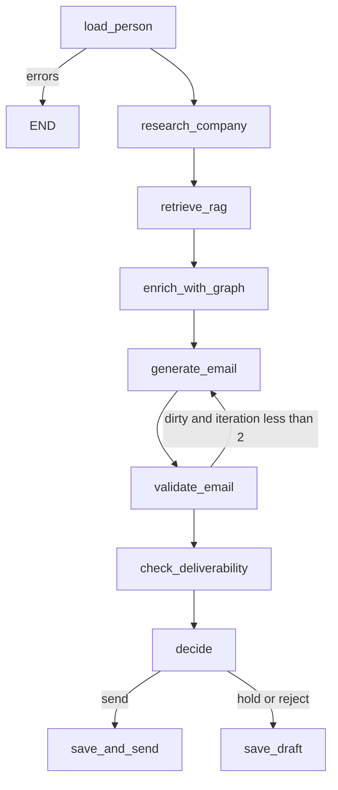

# Outreach AI Cortex — Days 1–12 recap

Study sheet: self-check questions, diagrams, interview prep.  
**Current Days 1–20 recap:** [days-1-20-summary.en.md](days-1-20-summary.en.md).  
Russian: [days-1-12-summary.ru.md](days-1-12-summary.ru.md) · [days-1-20.ru](days-1-20-summary.ru.md).

Shorter slices: [Days 1–5](days-1-5-summary.en.md) · [Days 1–8](days-1-8-summary.en.md) · [Day 10](../docs/DAY10_SUMMARY.md).

**Stack:** Python 3.12, FastAPI, SQLAlchemy 2.0 async, PostgreSQL 16, ChromaDB, Neo4j 5 (Bolt), Langfuse v2, Poetry, Docker Compose.  
**Hardware:** 8 GB RAM, Intel Iris Xe 128 MB VRAM — **no local LLMs**. Embeddings and chat are cloud-only; `*_MODE=mock` for CI. Neo4j: heap **512m**, pagecache **256m**, container ≤ **1024m**.  
**Base URL:** `http://localhost:8080/api/v1`  
**Working branch:** `cursor/day1-bootstrap-fastapi-stack` (not necessarily `main`).

---

## 1. The project in one paragraph

B2B outreach: company + lead → site parse → Chroma chunks → email (cloud LLM) → LangGraph (guardrails, hold/send/reject) → optional Neo4j intro graph (warm intro). Postgres is CRUD source of truth; Neo4j is a path index. No Kubernetes. Secrets stay in `.env`.

| Day | Outcome |
|-----|---------|
| 1 | Compose, FastAPI, health, Settings |
| 2 | Models, async Alembic, company CRUD |
| 3 | Person, EmailDraft, DomainHealth |
| 4 | SiteParser + `POST .../research` |
| 5 | LinkedIn mock/real + `POST /persons/research` |
| 6 | RAG: splitter, embeddings, Chroma, `/context` |
| 7 | LLMClient, EmailGenerator, `POST .../generate-email` |
| 8 | LangGraph agent, `POST /agent/outreach`, `agent_runs` |
| 9 | Langfuse, QualityScorer, AlertsService |
| 10 | Guardrails, RetryPolicy, analytics, prompt catalog |
| 11 | Neo4j schema, GraphService, sync, network/path API |
| 12 | Cypher library, influence, competitors, recommendations, `enrich_with_graph` |

---

## 2. Diagrams to memorize

### 2.1. Layers

```text
HTTP  →  routers/     status codes, Depends, no business logic
      →  services/    CRUD, research, RAG, LLM, agent, graph
      →  models/      SQLAlchemy 2.0 Mapped
      →  PostgreSQL   source of truth
      →  Chroma       RAG
      →  Neo4j        paths / intro (eventual consistency)

schemas/  = Pydantic (not the ORM)
core/     = Settings, engine, AsyncSession
```

Services take `AsyncSession` in `__init__` (**composition, not inheritance**). Adapters (`SiteParser`, `LinkedInService`, `LLMClient`, `Neo4jClient`) are injected so tests can fake them. `NEO4J_ENABLED=false` → client is a no-op; the API still boots.

### 2.2. ER (Postgres)



| Edge | `ondelete` | Meaning |
|------|------------|---------|
| persons → companies | `SET NULL` | delete company, keep the contact |
| email_drafts / agent_runs → persons | `CASCADE` | delete person, drop history |

Cascades are true in the **database**, not only in the ORM. Neo4j has **no** FKs: MERGE on sync, `DETACH DELETE` on remove.

### 2.3. HTTP semantics

| Code | When |
|------|------|
| 200 | OK, research with `errors[]`, upsert update |
| 201 | new entity |
| 204 | DELETE, empty body |
| 400 | person_id mismatch, etc. |
| 403 | graph sync without `X-Admin-Token` |
| 404 | **our** resource missing / no graph path |
| 409 | unique conflict |
| 422 | Pydantic |
| 502 | upstream (site, LLM, LinkedIn) |
| 503 | health: PG/Chroma/Neo4j down, or Neo4j disabled on graph API |

Lead site down ≠ 404. That is 200 + `errors`.

### 2.4. Product pipeline (Day 12)

```text
Company + Person
    → POST /companies/{domain}/research
         parse → raw_site_text → chunk → embed → Chroma company_{domain}
    → POST /persons/{id}/generate-email
         RAG → prompt → LLM JSON → validate → guardrails → EmailDraft
    → POST /agent/outreach
         load → research? → RAG → enrich_with_graph → generate
         → validate → deliverability → decide → save | save_and_send (stub)
    → Neo4j (optional)
         sync_all / write hooks → shortestPath / influence / warm intro
```

### 2.5. RAG (Day 6)

```text
raw_site_text → truncate 1M → splitter 1000/200 → drop < 50
  → embed mock HashEmbedder | cloud text-embedding-3-small
  → Chroma company_{domain}  cosine
  → GET /companies/{domain}/context?q=
```

`RAG_MODE=mock` uses hash vectors — **not** a local neural net.

### 2.6. Email (Days 7 + 10)

```text
system  = style + bans
user    = lead + RAG + sender + goal + optional warm-intro P.S.
LLM     = chat_json → {"subject","body"}  + RetryPolicy
validator → 1 retry → GuardrailPipeline → save + generation_context
```

Sender comes from the request, not a User table.

### 2.7. Agent (Days 8–12)



Repo diagram: [docs/agent_graph.mmd](../docs/agent_graph.mmd).

Default `AGENT_REQUIRE_HUMAN_APPROVAL=true` → **hold**. `save_and_send` is a stub `mark_sent` (no SMTP yet).

`thread_id` = `{person_id}:{uuid4()}` — never bare `person_id`.

`validation_errors` / `guardrail_results` **overwrite**, they do not use an `add` reducer: otherwise regen cannot clear leftover spam.

`enrich_with_graph` **does not block** generate: no Neo4j / no path → empty `graph_context`.

### 2.8. Neo4j (Days 11–12)

```text
Postgres  --GraphSyncService / write hooks-->  Neo4j
  Company / Person / EmailThread
  EMPLOYS + WORKS_AT
  CONNECTED_TO  (both directions)
  COMPETITOR_OF (both directions)
  PARTICIPATES_IN / SENT_TO
```

`shortestPath` hops are `*1..6` (Cypher **cannot** take `*..$max_depth`). No GDS plugin. Communities = Python BFS.

Postgres = CRUD. Neo4j = “who knows whom”. Drift is allowed (`NEO4J_AUTO_SYNC_ON_WRITE=false` in tests).

### 2.9. Async SQLAlchemy — three facts

1. Session = Unit of Work: atomicity at `commit()`.
2. `expire_on_commit=False` — otherwise async lazy-refresh → `MissingGreenlet`.
3. `selectinload` — a second `SELECT ... IN (...)`. Without it, `person.company` blows up under async.

### 2.10. Enums (`native_enum=False` → VARCHAR)

| Enum | Values |
|------|--------|
| EmailStatus | unknown, valid, invalid, catch_all, risky |
| CompanySize | micro … enterprise |
| EmailGoal | intro, follow_up, meeting, demo, nurture, breakup |

---

## 3. Days 1–8 (compressed)

Full Q&A: [days-1-8-summary.en.md](days-1-8-summary.en.md).

### Day 1 — skeleton

Compose: api:8080, postgres:5432, chroma:8000. Lifespan: `SELECT 1` + `engine.dispose()`. python:3.12-**slim** (not alpine: musl breaks asyncpg). `pool_pre_ping`. Health checks **dependencies**.

**Self-check:** why lifespan? why slim? why `pool_pre_ping`?

### Day 2 — models and company CRUD

Async Alembic `env.py`, URL from Settings. Domain normalized. 409 on unique. Logic in the service, not the router.

**Self-check:** why async env? FK vs relationship? autogenerate misses renames? 409 vs 400?

### Day 3 — Person, Draft, Deliverability

List without nested company. `selectinload`. `/deliverability` is a capability URL. 502 ≠ 404.

**Self-check:** N+1? `ondelete` in DB vs ORM cascade? upsert = get+update + unique.

### Day 4 — parser

httpx + backoff, trafilatura, SSRF guard, `raw_site_text` ≤ 50k, 200 + `errors`.

**Self-check:** why not requests? text cap? mocks in CI?

### Day 5 — LinkedIn

mock = sha256(username); real = Phantombuster + fallback. `POST /persons/research` **above** `/{id}`.

**Self-check:** idempotency? cache vs refresh? ToS / no homemade Selenium?

### Day 6 — RAG

collection `company_{domain}`, overlap 200, `@lru_cache` on the Chroma HttpClient. Empty crawl does not wipe text. Research does not 502 because RAG failed.

**Self-check:** small vs large embeddings? why no local model? delete+recreate collection?

### Day 7 — email

`chat_json`, validator + regen, `generation_context`, CostTracker. LLM health = key present, not a chat call.

**Self-check:** system vs user? JSON mode? save a dirty draft? what to mock?

### Day 8 — agent

Policy lives in edges, not in the LLM. MemorySaver. `agent_runs.final_state`. Human-in-the-loop.

**Self-check:** why unique thread_id? overwrite vs add? why is send a stub?

---

## 4. Day 9 — Langfuse, scoring, alerts

Traces: agent, nodes, LLM generations. Heuristic `QualityScorer` (personalization, CTA, length). `AlertsService` — cost / error-rate thresholds. Keys optional: no key → tracing no-op.

**Self-check**

1. **Why self-hosted Langfuse, not SaaS?** Email copy stays on the same Compose network.
2. **Why heuristic scores, not LLM-as-judge?** Cost and RAM; a judge is another generation.
3. **What belongs on a span?** decision, tokens, draft_id — not extra PII.
4. **Why flush in finally?** Do not drop the trace if something fails after the LLM.

**Interview:** traces vs spans vs generations; tying cost to a run; sampling in production.

---

## 5. Day 10 — Guardrails, retry, analytics

`GuardrailPipeline` (heuristic hallucination, policy, PII, structure) runs in parallel; blockers do not crash the process: regen + `guardrail_results` JSONB. `RetryPolicy` on `LLMClient` covers rate limit / timeout / connection only — **not** validation 4xx. Analytics: cost by model, send/hold/reject mix, scores. Catalog: [PROMPTS.md](../PROMPTS.md).

**Self-check**

1. **Why no retry on 400?** Repeating a bad prompt burns quota.
2. **Why analytics in Postgres, not only Langfuse?** Investor metrics live next to `agent_runs` / drafts; Langfuse is for debugging.
3. **PII regex vs real NER?** Regex on 8 GB; an NER model is banned by hardware.

**Interview:** layered defenses (prompt + validator + guardrail + human hold); retry idempotency; investor KPIs (cost/run, send mix, personalization) vs vanity tokens.

---

## 6. Day 11 — Neo4j bootstrap

Async Bolt `Neo4jClient`, no-op when disabled. Schema: Company, Person, EmailThread; `WORKS_AT`/`EMPLOYS`, `CONNECTED_TO`, `COMPETITOR_OF`. `GraphSyncService` rebuilds from Postgres. `POST /graph/sync` + `GRAPH_SYNC_TOKEN`. Health = `verify_connectivity`. Write-up: [neo4j-vs-postgresql-graph-queries.md](neo4j-vs-postgresql-graph-queries.md).

**Self-check**

1. **Why MERGE, not CREATE?** Re-sync must not duplicate `id`.
2. **Why DETACH DELETE?** Avoid dangling relationships.
3. **Why is Postgres SoT?** Transactions, uniques, Alembic; the graph is a derived index.
4. **Why auto_sync_on_write=false in tests?** CRUD pytest must not open Bolt.

**Interview:** graph vs recursive CTE; eventual consistency; indexes on `id`/`domain`; heap limits on a small machine.

---

## 7. Day 12 — advanced queries and the agent

Constants: `backend/app/services/graph/queries.py`. Services: networks, paths, mutuals, influence (`direct + 0.5 * second`), competitors, recommendations, analytics (BFS communities). HTTP: `/graph/...` including `/graph/analytics/*`. Node `enrich_with_graph` + P.S. in the prompt. Patterns: [graph-query-patterns.md](graph-query-patterns.md), recipes: [docs/graph-recipes.md](../docs/graph-recipes.md).

**Self-check**

1. **Why a Cypher library file?** Change queries without rewriting orchestration; easier review and Browser paste.
2. **Why does depth=2 explode?** Each neighbor fans out → `LIMIT`, indexed anchors, no unbounded `*`.
3. **max_depth=6?** Six-degrees cap; intros usually want 3–4 hops.
4. **Why bidirectional COMPETITOR_OF?** Lookup does not depend on who added whom first.
5. **Influence vs short path?** Distance first; influence is the tie-break.
6. **Connected components?** Islands of acquaintances → different outreach strategies.
7. **Why graph analytics on the graph router?** Source is Neo4j, not Postgres analytics.
8. **Why graph_context does not block generate?** Signal, not a precondition.
9. **How to mock Cypher?** Fake `execute_query` / `execute_write`, dispatch on query text.
10. **Why document patterns?** Onboarding + interviews + no accidental full scans.

**Interview:** BFS vs DFS vs Dijkstra; EXPLAIN vs PROFILE; WCC without GDS; graph recommendation signals.

---

## 8. Classic traps (all days)

| Trap | Do this instead |
|------|-----------------|
| Service subclasses `AsyncSession` | `__init__(self, db)` |
| Lazy load under async | `selectinload` |
| `GET /{id}` eats `/research` | Static path **first** |
| Duplicate without unique | App check **and** constraint |
| Sync HTTP in FastAPI | async httpx |
| Exception when the site is dead | 200 + `errors` |
| `random` in LinkedIn mock | `sha256(username)` |
| Local LLM “just for now” | Forbidden by hardware |
| LLM call in healthcheck | Key presence only |
| `thread_id=person_id` | `{person_id}:{uuid4()}` |
| `add` on `validation_errors` | Overwrite after regen |
| Retry on LLM 400 | 429 / timeout / connect only |
| `*..$max_depth` in Cypher | `*1..6` in the pattern |
| GDS / PageRank on Iris Xe | Skip; BFS / degree |
| Neo4j as SoT | Postgres CRUD, graph as index |
| Graph API with Neo4j off | 503; agent still generates |
| Commit `.env` | `.env.example` only |

---

## 9. API map

| Method | Path | Role |
|--------|------|------|
| GET | `/health` | PG + Chroma + LLM config + Neo4j |
| * | `/companies/` | CRUD + research + context |
| * | `/persons/` | CRUD + research + generate-email |
| * | `/email-drafts/` | CRUD + mark-sent |
| * | `/deliverability/` | upsert SPF/DKIM |
| POST/GET | `/agent/outreach`, `/agent/runs` | graph and history |
| * | `/analytics/` | cost, decisions, scores (Postgres) |
| * | `/graph/` | network, path, influence, competitors, graph-analytics, sync |

---

## 10. Commands

```bash
cp .env.example .env
docker compose build
docker compose up -d
docker compose exec api poetry run alembic upgrade head
curl http://localhost:8080/api/v1/health
docker compose exec api poetry run pytest -v
```

Happy path (mock LLM / RAG / LinkedIn):

```bash
curl -s -X POST http://localhost:8080/api/v1/companies/ \
  -H "Content-Type: application/json" \
  -d '{"domain":"stripe.com","name":"Stripe"}'
curl -s -X POST http://localhost:8080/api/v1/companies/stripe.com/research
curl -s -X POST http://localhost:8080/api/v1/persons/research \
  -H "Content-Type: application/json" \
  -d '{"linkedin_url":"https://linkedin.com/in/johndoe","company_domain":"stripe.com"}'
curl -s -X POST http://localhost:8080/api/v1/persons/{id}/generate-email \
  -H "Content-Type: application/json" \
  -d '{"person_id":"{id}","goal":"meeting","sender_name":"Kirill","sender_title":"Founder","sender_company":"AI Cortex"}'
curl -s -X POST http://localhost:8080/api/v1/agent/outreach \
  -H "Content-Type: application/json" \
  -d '{"person_id":"{id}","goal":"meeting","sender_name":"Kirill","sender_title":"Founder","sender_company":"AI Cortex"}'
```

Default agent expectation: `decision=hold` (approval). Warm intro: inspect `generation_context.graph_context`.

Neo4j:

```bash
docker compose up -d neo4j
docker compose exec api poetry run python -m scripts.sync_to_neo4j
# Browser http://localhost:7474
# POST /api/v1/graph/sync  header X-Admin-Token
```

---

## 11. Interview bank (compress before the call)

**Backend / SQLAlchemy:** Unit of Work, expire_on_commit, selectinload vs N+1, 409 vs unique, async session leak, Alembic async env.

**HTTP / API:** thin router, 404 vs 502 vs 503, graceful degradation, static path before `{id}`, capability URLs.

**Parsing / integrations:** httpx vs requests, SSRF, retry/backoff, mock vs real, LinkedIn ToS.

**RAG:** chunk/overlap, cosine, small embeddings, collection isolation, why no local model.

**LLM:** system/user, temperature, JSON mode, token limit, RetryPolicy, why health does not chat.

**Agents:** graph vs AgentExecutor, overwrite reducers, checkpointer, unique thread_id, human-in-the-loop, optional graph enrich.

**Observability:** Langfuse traces/spans/generations, heuristic scores, investor KPIs.

**Guardrails:** layered policy, PII without heavy NER, persist `guardrail_results`.

**Graphs:** MERGE vs CREATE, shortestPath, influence formula, bidirectional rels, CTE vs Neo4j, EXPLAIN/PROFILE, connected components without GDS.

---

## 12. Materials

| Topic | Link |
|-------|------|
| Architecture | [docs/ARCHITECTURE.md](../docs/ARCHITECTURE.md) |
| Agent diagram | [docs/agent_graph.mmd](../docs/agent_graph.mmd) |
| Prompts | [PROMPTS.md](../PROMPTS.md) |
| Langfuse | [langfuse-observability-for-llm.md](langfuse-observability-for-llm.md) |
| LangGraph vs agents | [langgraph-vs-langchain-agents.md](langgraph-vs-langchain-agents.md) |
| LinkedIn mock vs real | [linkedin-mock-vs-real.md](linkedin-mock-vs-real.md) |
| Neo4j vs Postgres | [neo4j-vs-postgresql-graph-queries.md](neo4j-vs-postgresql-graph-queries.md) |
| Cypher patterns | [graph-query-patterns.md](graph-query-patterns.md) |
| Graph recipes | [docs/graph-recipes.md](../docs/graph-recipes.md) |
| SQLAlchemy loading | https://docs.sqlalchemy.org/en/20/orm/loading_relationships.html |
| LangGraph | https://langchain-ai.github.io/langgraph/concepts/ |
| Cypher shortestPath | https://neo4j.com/docs/cypher-manual/current/clauses/match/#shortestpath |
| Query tuning | https://neo4j.com/docs/cypher-manual/current/query-tuning/ |

---

## 13. Commits (orientation)

| Day | Prefix |
|-----|--------|
| 1 | bootstrap FastAPI + PG + Chroma |
| 2 | `[MODELS]` |
| 3 | `[CRUD]` |
| 4 | `[PARSER]` |
| 5 | `[LINKEDIN]` |
| 6 | `[RAG]` |
| 7 | `[LLM]` |
| 8 | `[AGENT]` |
| 9 | `[OBSERVABILITY]` |
| 10 | `[POLISH]` |
| 11 | `[GRAPH]` Neo4j setup |
| 12 | `[GRAPH]` advanced queries |

Later product work (days 13–20 already in-repo): React, live DNS, warmup, email finder, Apollo/sequences, CRM/n8n. Recap: [days-1-20-summary.en.md](days-1-20-summary.en.md). Prompts 21+: [docs/day-prompts/README.md](../docs/day-prompts/README.md).
