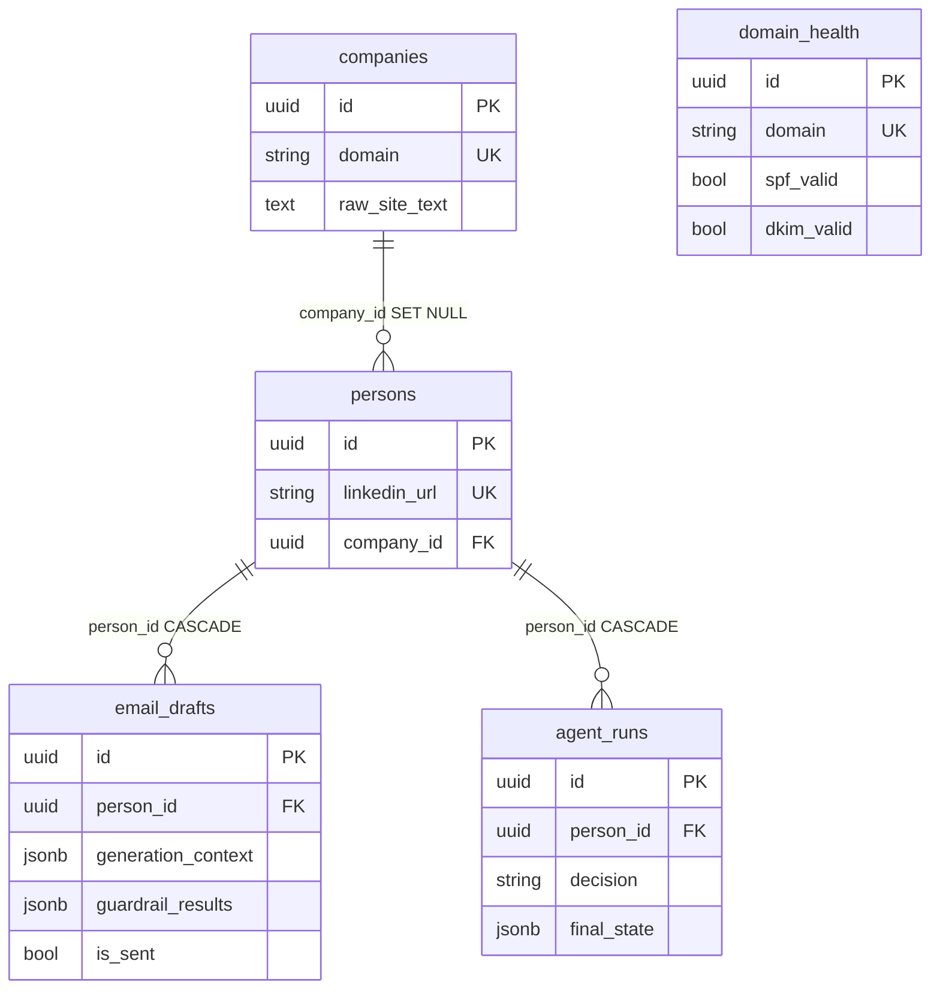
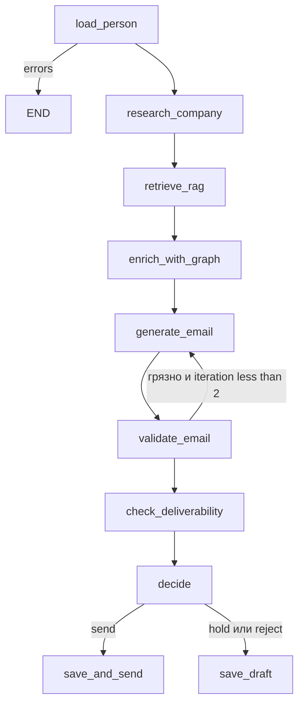

# Outreach AI Cortex — итоги дней 1–12

Шпаргалка: самопроверка, схемы, подготовка к собеседованию.  
**Актуальный срез дней 1–20:** [days-1-20-summary.ru.md](days-1-20-summary.ru.md).  
English: [days-1-12-summary.en.md](days-1-12-summary.en.md) · [days-1-20.en](days-1-20-summary.en.md).

Детальнее по срезам: [дни 1–5](days-1-5-summary.ru.md) · [дни 1–8](days-1-8-summary.ru.md) · [день 10 (EN)](../docs/DAY10_SUMMARY.md).

**Стек:** Python 3.12, FastAPI, SQLAlchemy 2.0 async, PostgreSQL 16, ChromaDB, Neo4j 5 (Bolt), Langfuse v2, Poetry, Docker Compose.  
**Железо:** 8 GB RAM, Intel Iris Xe 128 MB VRAM — **никаких локальных LLM**. Эмбеддинги и chat только облако; `*_MODE=mock` для CI. Neo4j: heap **512m**, pagecache **256m**, контейнер ≤ **1024m**.  
**Базовый URL:** `http://localhost:8080/api/v1`  
**Рабочая ветка:** `cursor/day1-bootstrap-fastapi-stack` (не обязательно `main`).

---

## 1. Проект в одном абзаце

B2B-outreach: компания + лид → парсинг сайта → чанки в Chroma → письмо (облачный LLM) → LangGraph (guardrails, hold/send/reject) → опционально граф знакомств в Neo4j (warm intro). Postgres — источник истины для CRUD; Neo4j — индекс путей. Без Kubernetes. Секреты только в `.env`.

| День | Суть |
|------|------|
| 1 | Compose, FastAPI, health, Settings |
| 2 | Модели, Alembic async, CRUD companies |
| 3 | Person, EmailDraft, DomainHealth |
| 4 | SiteParser + `POST .../research` |
| 5 | LinkedIn mock/real + `POST /persons/research` |
| 6 | RAG: splitter, embeddings, Chroma, `/context` |
| 7 | LLMClient, EmailGenerator, `POST .../generate-email` |
| 8 | LangGraph-агент, `POST /agent/outreach`, `agent_runs` |
| 9 | Langfuse, QualityScorer, AlertsService |
| 10 | Guardrails, RetryPolicy, analytics, каталог промптов |
| 11 | Neo4j схема, GraphService, sync, базовые network/path API |
| 12 | Cypher-библиотека, influence, competitors, recommendations, `enrich_with_graph` |

---

## 2. Схемы для запоминания

### 2.1. Слои

```text
HTTP  →  routers/     статусы, Depends, без бизнес-логики
      →  services/    CRUD, research, RAG, LLM, agent, graph
      →  models/      SQLAlchemy 2.0 Mapped
      →  PostgreSQL   source of truth
      →  Chroma       RAG
      →  Neo4j        paths / intro (eventual consistency)

schemas/  = Pydantic (не ORM)
core/     = Settings, engine, AsyncSession
```

Сервис получает `AsyncSession` в конструкторе (**композиция, не наследование**). Адаптеры (`SiteParser`, `LinkedInService`, `LLMClient`, `Neo4jClient`) инжектятся — так их мокают. `NEO4J_ENABLED=false` → клиент no-op, API живёт.

### 2.2. ER (Postgres)



| Связь | `ondelete` | Смысл |
|--------|------------|--------|
| persons → companies | `SET NULL` | компания удалена — контакт жив |
| email_drafts / agent_runs → persons | `CASCADE` | человек удалён — история тоже |

Каскад — истина в **БД**, не только в ORM. Neo4j **не** FK: узлы синкаются MERGE, удаление — `DETACH DELETE`.

### 2.3. HTTP-семантика

| Код | Когда |
|-----|--------|
| 200 | OK, research с `errors[]`, upsert-обновление |
| 201 | новая сущность |
| 204 | DELETE без тела |
| 400 | person_id mismatch и т.п. |
| 403 | graph sync без `X-Admin-Token` |
| 404 | **нашего** ресурса нет / нет path в графе |
| 409 | unique conflict |
| 422 | Pydantic |
| 502 | апстрим (сайт, LLM, LinkedIn) |
| 503 | health: PG/Chroma/Neo4j down или Neo4j выключен на graph API |

Сайт лида лежит ≠ 404. Это 200 + `errors`.

### 2.4. Пайплайн продукта (день 12)

```text
Company + Person
    → POST /companies/{domain}/research
         parse → raw_site_text → chunk → embed → Chroma company_{domain}
    → POST /persons/{id}/generate-email
         RAG → prompt → LLM JSON → validate → guardrails → EmailDraft
    → POST /agent/outreach
         load → research? → RAG → enrich_with_graph → generate
         → validate → deliverability → decide → save | save_and_send (stub)
    → Neo4j (optional)
         sync_all / write hooks → shortestPath / influence / warm intro
```

### 2.5. RAG (день 6)

```text
raw_site_text → truncate 1M → splitter 1000/200 → drop < 50
  → embed mock HashEmbedder | cloud text-embedding-3-small
  → Chroma company_{domain}  cosine
  → GET /companies/{domain}/context?q=
```

`RAG_MODE=mock` — hash-векторы, **не** локальная нейросеть.

### 2.6. Письмо (дни 7 + 10)

```text
system  = стиль + запреты
user    = лид + RAG + sender + goal + optional warm-intro P.S.
LLM     = chat_json → {"subject","body"}  + RetryPolicy
validator → 1 retry → GuardrailPipeline → save + generation_context
```

Sender приходит в запросе, не из таблицы User.

### 2.7. Агент (дни 8–12)



Диаграмма в репо: [docs/agent_graph.mmd](../docs/agent_graph.mmd).

По умолчанию `AGENT_REQUIRE_HUMAN_APPROVAL=true` → **hold**. `save_and_send` — stub `mark_sent` (SMTP ещё нет).

`thread_id` = `{person_id}:{uuid4()}` — не голый `person_id`.

`validation_errors` / `guardrail_results` — **overwrite**, не `add`-reducer: иначе реген не очистит старый spam.

`enrich_with_graph` **не блокирует** generate: нет Neo4j / нет path → пустой `graph_context`.

### 2.8. Neo4j (дни 11–12)

```text
Postgres  --GraphSyncService / write hooks-->  Neo4j
  Company / Person / EmailThread
  EMPLOYS + WORKS_AT
  CONNECTED_TO  (оба направления)
  COMPETITOR_OF (оба направления)
  PARTICIPATES_IN / SENT_TO
```

`shortestPath` hops = `*1..6` (в Cypher **нельзя** `*..$max_depth`). GDS не ставим. Communities — BFS в Python.

Postgres = CRUD. Neo4j = «кто кого знает». Рассинхрон допустим (`NEO4J_AUTO_SYNC_ON_WRITE=false` в тестах).

### 2.9. Async SQLAlchemy — три факта

1. Сессия = Unit of Work: атомарность на `commit()`.
2. `expire_on_commit=False` — иначе async lazy-refresh → `MissingGreenlet`.
3. `selectinload` — второй `SELECT ... IN (...)`. Без него `person.company` в async падает.

### 2.10. Enums (`native_enum=False` → VARCHAR)

| Enum | Значения |
|------|----------|
| EmailStatus | unknown, valid, invalid, catch_all, risky |
| CompanySize | micro … enterprise |
| EmailGoal | intro, follow_up, meeting, demo, nurture, breakup |

---

## 3. Дни 1–8 (сжато)

Полные вопросы: [days-1-8-summary.ru.md](days-1-8-summary.ru.md).

### День 1 — каркас

Compose: api:8080, postgres:5432, chroma:8000. Lifespan: `SELECT 1` + `engine.dispose()`. python:3.12-**slim** (не alpine: musl ломает asyncpg). `pool_pre_ping`. Health проверяет **зависимости**.

**Самопроверка:** зачем lifespan? почему slim? зачем `pool_pre_ping`?

### День 2 — модели и CRUD компаний

Alembic async `env.py`, URL из Settings. Domain нормализуется. 409 на unique. Сервис, не роутер.

**Самопроверка:** почему async env? FK vs relationship? autogenerate не видит rename? 409 vs 400?

### День 3 — Person, Draft, Deliverability

List без nested company. `selectinload`. `/deliverability` — capability URL. 502 ≠ 404.

**Самопроверка:** N+1? `ondelete` в БД vs ORM cascade? upsert = get+update + unique.

### День 4 — парсер

httpx + backoff, trafilatura, SSRF-гард, `raw_site_text` ≤ 50k, 200 + `errors`.

**Самопроверка:** почему не requests? потолок текста? моки в CI?

### День 5 — LinkedIn

mock = sha256(username); real = Phantombuster + fallback. `POST /persons/research` **выше** `/{id}`.

**Самопроверка:** идемпотентность? cache vs refresh? ToS / не свой Selenium?

### День 6 — RAG

collection `company_{domain}`, overlap 200, `@lru_cache` на Chroma HttpClient. Пустой crawl не затирает текст. Research не 502 из-за RAG.

**Самопроверка:** small vs large embeddings? почему не local model? delete+recreate коллекции?

### День 7 — письмо

`chat_json`, validator + реген, `generation_context`, CostTracker. Health LLM = ключ, не chat.

**Самопроверка:** system vs user? JSON mode? сохранить грязный draft? что мокать?

### День 8 — агент

Политика в рёбрах, не в LLM. MemorySaver. `agent_runs.final_state`. human-in-the-loop.

**Самопроверка:** зачем unique thread_id? overwrite vs add? почему send — stub?

---

## 4. День 9 — Langfuse, скоринг, алерты

Трейсы: агент, ноды, LLM generations. Heuristic `QualityScorer` (персонализация, CTA, длина). `AlertsService` — порог стоимости / error rate. Keys опциональны: без ключа трейсинг no-op.

**Самопроверка**

1. **Зачем self-hosted Langfuse, не SaaS?** Данные писем не уезжают наружу; контейнер на том же Compose.
2. **Почему скоринг эвристический, не LLM-as-judge?** Деньги и RAM; judge — отдельный вызов.
3. **Что писать в span?** decision, tokens, draft_id — не сырой PII сверх нужного.
4. **Почему flush в finally?** Иначе потеряем трассу при исключении после LLM.

**Собеседование:** traces vs spans vs generations; как связать cost с run; sampling в проде.

---

## 5. День 10 — Guardrails, retry, analytics

`GuardrailPipeline` (hallucination-heuristic, policy, PII, structure) — параллельно, блокеры не роняют процесс: реген + `guardrail_results` JSONB. `RetryPolicy` в `LLMClient` — только rate limit / timeout / connection, **не** 4xx валидации. Analytics: cost по модели, mix send/hold/reject, scores. Каталог: [PROMPTS.md](../PROMPTS.md).

**Самопроверка**

1. **Почему retry не на 400?** Повтор того же плохого промпта сожрёт квоту.
2. **Зачем analytics в Postgres, не в Langfuse?** Investor-метрики живут с `agent_runs` / drafts; Langfuse — отладка.
3. **PII regex vs настоящий NER?** Regex на 8 GB; NER-модель запрещена железом.

**Собеседование:** layered defenses (prompt + validator + guardrail + human hold); идемпотентность retry; какие KPI показывать инвестору (cost/run, send mix, personalization) vs vanity tokens.

---

## 6. День 11 — Neo4j bootstrap

`Neo4jClient` async Bolt, no-op если выключен. Схема: Company, Person, EmailThread; `WORKS_AT`/`EMPLOYS`, `CONNECTED_TO`, `COMPETITOR_OF`. `GraphSyncService` — полный rebuild из Postgres. `POST /graph/sync` + `GRAPH_SYNC_TOKEN`. Health Neo4j = `verify_connectivity`. Research: [neo4j-vs-postgresql-graph-queries.md](neo4j-vs-postgresql-graph-queries.md).

**Самопроверка**

1. **Почему MERGE, не CREATE?** Повторный sync не плодит дубликаты по `id`.
2. **Зачем DETACH DELETE?** Иначе висячие рёбра.
3. **Почему Postgres SoT?** Транзакции, unique, Alembic; граф — производный индекс.
4. **auto_sync_on_write=false в тестах?** CRUD pytest не должен открывать Bolt.

**Собеседование:** граф vs recursive CTE; eventual consistency; индексы на `id`/`domain`; лимиты heap на слабой машине.

---

## 7. День 12 — сложные запросы и агент

Константы: `backend/app/services/graph/queries.py`. Сервисы: networks, paths, mutuals, influence (`direct + 0.5 * second`), competitors, recommendations, analytics (BFS communities). HTTP: `/graph/...` включая `/graph/analytics/*`. Нода `enrich_with_graph` + P.S. в промпте. Паттерны: [graph-query-patterns.md](graph-query-patterns.md), рецепты: [docs/graph-recipes.md](../docs/graph-recipes.md).

**Самопроверка**

1. **Почему Cypher в отдельном файле?** Менять запрос без диффа оркестрации; проще ревью и Browser.
2. **Почему depth=2 взрывается?** Каждый сосед тянет соседей → `LIMIT`, якорь по индексу, не unbounded `*`.
3. **max_depth=6?** Потолок six degrees; для intro обычно 3–4.
4. **Зачем COMPETITOR_OF в обе стороны?** Запрос не зависит от того, кто добавил первым.
5. **Influence vs короткий путь?** Сначала дистанция intro; influence — тай-брейк.
6. **Connected components?** Острова знакомств = разные стратегии outreach.
7. **Почему graph-analytics в graph router?** Источник — Neo4j, не Postgres analytics.
8. **Почему graph_context не блокирует generate?** Сигнал, не precondition.
9. **Как мокать Cypher?** Fake `execute_query` / `execute_write`, dispatch по тексту запроса.
10. **Зачем документировать паттерны?** Онбординг + собес + не плодить full scan.

**Собеседование:** BFS vs DFS vs Dijkstra; EXPLAIN vs PROFILE; WCC без GDS; сигналы рекомендательной системы на графе.

---

## 8. Типичные ловушки (все дни)

| Ловушка | Как правильно |
|---------|----------------|
| Сервис наследует `AsyncSession` | `__init__(self, db)` |
| Lazy load в async | `selectinload` |
| `GET /{id}` съедает `/research` | Статический путь **выше** |
| Дубликат без unique | Check **и** constraint |
| Sync HTTP в FastAPI | httpx async |
| Exception на мёртвый сайт | 200 + `errors` |
| `random` в LinkedIn mock | `sha256(username)` |
| Локальная LLM «для простоты» | Запрещено железом |
| LLM в healthcheck | Только наличие ключа |
| `thread_id=person_id` | `{person_id}:{uuid4()}` |
| `add` на `validation_errors` | Overwrite после регена |
| Retry на 400 LLM | Только 429 / timeout / connect |
| `*..$max_depth` в Cypher | `*1..6` в паттерне |
| GDS / PageRank на Iris Xe | Не ставить; BFS / degree |
| Neo4j как SoT | Postgres CRUD, граф — индекс |
| Graph API при `NEO4J_ENABLED=false` | 503, агент всё равно генерит |
| Коммит `.env` | Только `.env.example` |

---

## 9. Карта API (итог)

| Метод | Путь | Смысл |
|--------|------|--------|
| GET | `/health` | PG + Chroma + LLM-конфиг + Neo4j |
| * | `/companies/` | CRUD + research + context |
| * | `/persons/` | CRUD + research + generate-email |
| * | `/email-drafts/` | CRUD + mark-sent |
| * | `/deliverability/` | upsert SPF/DKIM |
| POST/GET | `/agent/outreach`, `/agent/runs` | граф и история |
| * | `/analytics/` | cost, decisions, scores (Postgres) |
| * | `/graph/` | network, path, influence, competitors, graph-analytics, sync |

---

## 10. Команды

```bash
cp .env.example .env
docker compose build
docker compose up -d
docker compose exec api poetry run alembic upgrade head
curl http://localhost:8080/api/v1/health
docker compose exec api poetry run pytest -v
```

Полный контур (mock LLM / RAG / LinkedIn):

```bash
curl -s -X POST http://localhost:8080/api/v1/companies/ \
  -H "Content-Type: application/json" \
  -d '{"domain":"stripe.com","name":"Stripe"}'
curl -s -X POST http://localhost:8080/api/v1/companies/stripe.com/research
curl -s -X POST http://localhost:8080/api/v1/persons/research \
  -H "Content-Type: application/json" \
  -d '{"linkedin_url":"https://linkedin.com/in/johndoe","company_domain":"stripe.com"}'
curl -s -X POST http://localhost:8080/api/v1/persons/{id}/generate-email \
  -H "Content-Type: application/json" \
  -d '{"person_id":"{id}","goal":"meeting","sender_name":"Kirill","sender_title":"Founder","sender_company":"AI Cortex"}'
curl -s -X POST http://localhost:8080/api/v1/agent/outreach \
  -H "Content-Type: application/json" \
  -d '{"person_id":"{id}","goal":"meeting","sender_name":"Kirill","sender_title":"Founder","sender_company":"AI Cortex"}'
```

Ожидание агента по умолчанию: `decision=hold` (approval). Warm intro: смотри `generation_context.graph_context`.

Neo4j:

```bash
docker compose up -d neo4j
docker compose exec api poetry run python -m scripts.sync_to_neo4j
# Browser http://localhost:7474
# POST /api/v1/graph/sync  header X-Admin-Token
```

---

## 11. Банк вопросов (сжать перед звонком)

**Backend / SQLAlchemy:** Unit of Work, expire_on_commit, selectinload vs N+1, 409 vs unique, async session leak, Alembic async env.

**HTTP / API:** тонкий роутер, 404 vs 502 vs 503, graceful degradation, статический путь до `{id}`, capability URL.

**Парсинг / интеграции:** httpx vs requests, SSRF, retry/backoff, mock vs real, ToS LinkedIn.

**RAG:** chunk/overlap, cosine, small embeddings, изоляция коллекций, почему не local model.

**LLM:** system/user, temperature, JSON mode, token limit, RetryPolicy, почему не health→chat.

**Агенты:** граф vs AgentExecutor, reducer overwrite, checkpointer, unique thread_id, human-in-the-loop, optional graph enrich.

**Observability:** Langfuse traces/spans/generations, heuristic scores, investor KPIs.

**Guardrails:** layered policy, PII без тяжёлого NER, persist `guardrail_results`.

**Графы:** MERGE vs CREATE, shortestPath, influence formula, bidirectional rels, CTE vs Neo4j, EXPLAIN/PROFILE, connected components без GDS.

---

## 12. Материалы

| Тема | Ссылка |
|------|--------|
| Архитектура | [docs/ARCHITECTURE.md](../docs/ARCHITECTURE.md) |
| Диаграмма агента | [docs/agent_graph.mmd](../docs/agent_graph.mmd) |
| Промпты | [PROMPTS.md](../PROMPTS.md) |
| Langfuse | [langfuse-observability-for-llm.md](langfuse-observability-for-llm.md) |
| LangGraph vs agents | [langgraph-vs-langchain-agents.md](langgraph-vs-langchain-agents.md) |
| LinkedIn mock vs real | [linkedin-mock-vs-real.md](linkedin-mock-vs-real.md) |
| Neo4j vs Postgres | [neo4j-vs-postgresql-graph-queries.md](neo4j-vs-postgresql-graph-queries.md) |
| Cypher-паттерны | [graph-query-patterns.md](graph-query-patterns.md) |
| Graph recipes | [docs/graph-recipes.md](../docs/graph-recipes.md) |
| SQLAlchemy loading | https://docs.sqlalchemy.org/en/20/orm/loading_relationships.html |
| LangGraph | https://langchain-ai.github.io/langgraph/concepts/ |
| Cypher shortestPath | https://neo4j.com/docs/cypher-manual/current/clauses/match/#shortestpath |
| Query tuning | https://neo4j.com/docs/cypher-manual/current/query-tuning/ |

---

## 13. Коммиты (ориентир)

| День | Префикс |
|------|---------|
| 1 | bootstrap FastAPI + PG + Chroma |
| 2 | `[MODELS]` |
| 3 | `[CRUD]` |
| 4 | `[PARSER]` |
| 5 | `[LINKEDIN]` |
| 6 | `[RAG]` |
| 7 | `[LLM]` |
| 8 | `[AGENT]` |
| 9 | `[OBSERVABILITY]` |
| 10 | `[POLISH]` |
| 11 | `[GRAPH]` Neo4j setup |
| 12 | `[GRAPH]` advanced queries |

Дальше по продукту (дни 13–20 уже в репо): React, DNS deliverability, warmup, email finder, Apollo/sequences, CRM/n8n. Сводка: [days-1-20-summary.ru.md](days-1-20-summary.ru.md). Промпты 21+: [docs/day-prompts/README.md](../docs/day-prompts/README.md).
