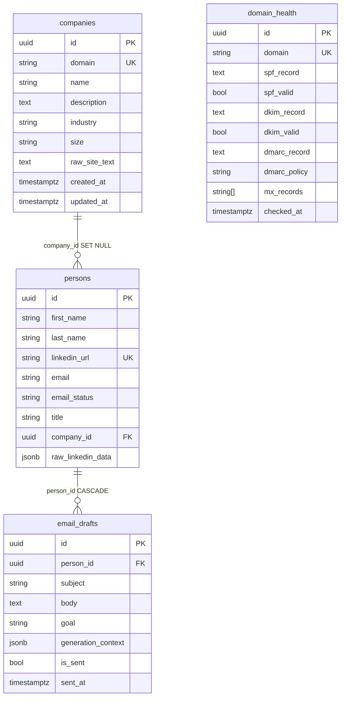

# Outreach AI Cortex — Days 1–5 recap

Study sheet for self-checks and interview prep (Days 1–5).  
Full Days 1–12 recap: [days-1-12-summary.en.md](days-1-12-summary.en.md).  
Full Days 1–8: [days-1-8-summary.en.md](days-1-8-summary.en.md).  
Russian version: [days-1-5-summary.ru.md](days-1-5-summary.ru.md).

---

## 1. The project in one paragraph

B2B outreach platform: FastAPI + async SQLAlchemy 2.0 + PostgreSQL 16 + ChromaDB, Docker Compose only (no Kubernetes, no local LLMs). Days 1–5 built the data core and enrichment: CRUD for companies/people/drafts, site parsing, LinkedIn mock/real.

**Stack:** Python 3.12, Poetry, Pydantic v2, Alembic (async), httpx, trafilatura, BeautifulSoup+lxml.  
**Hardware:** 8 GB RAM → slim images, API ≤ 512 MB, no Ollama/PyTorch.

Base URL: `http://localhost:8080/api/v1`

---

## 2. Diagrams to memorize

### 2.1. Application layers

```text
HTTP  →  routers/     (status codes, Depends, no business logic)
      →  services/    (CRUD, research, external APIs)
      →  models/      (SQLAlchemy 2.0 Mapped)
      →  PostgreSQL

schemas/  = Pydantic request/response (separate from ORM)
core/     = Settings, engine, AsyncSession
```

Rule: keep routers thin. Services take `AsyncSession` in `__init__` (composition, **not** inheritance). External adapters (`SiteParser`, `LinkedInService`) are injected so tests can fake them.

### 2.2. ER diagram



Cascades live in the **database**, not only in the ORM:

| Relation | `ondelete` | Meaning |
|----------|------------|---------|
| `persons.company_id` → companies | `SET NULL` | company gone — contact remains |
| `email_drafts.person_id` → persons | `CASCADE` | person gone — drafts gone |

### 2.3. HTTP request path (memorize)

```text
Client
  → FastAPI router (Pydantic validation = 422)
  → Service (select / commit)
  → IntegrityError / NotFoundError / DuplicateError
  → HTTP 409 / 404 / 201 / 200 / 204
```

Status semantics:

| Code | When |
|------|------|
| 200 | OK, including upsert-update and research with `errors[]` |
| 201 | new row created |
| 204 | DELETE, empty body |
| 400 | JSON ok, domain error (rare; usually 422) |
| 404 | **our** resource is missing (company/person) |
| 409 | uniqueness conflict (domain, linkedin_url) |
| 422 | Pydantic / path UUID |
| 502 | unexpected upstream failure (site, LinkedIn vendor) |

404 ≠ “the lead’s website is down”. Down site → 200 + `errors` (graceful degradation), or 502 only on a crash.

### 2.4. Research flows

```text
POST /companies/{domain}/research
  404 if company row missing
  SiteParser: https://{domain} + /about /product /services /solutions /pricing
  trafilatura → BS4 fallback
  raw_site_text ≤ 50_000
  200 + pages_parsed + errors + duration

POST /persons/research
  422 if URL is not LinkedIn /in/
  cache hit on linkedin_url → source=cache (no Phantombuster)
  else LinkedInService (mock | real→fallback mock)
  company: company_domain | profile name | slug + ".com"
  source = cache | mock | phantombuster
```

### 2.5. Async SQLAlchemy — three facts

1. Session = **Unit of Work**: buffers writes, flushes atomically on `commit()`.
2. `expire_on_commit=False` — attributes stay in memory after commit. Otherwise async lazy-refresh → `MissingGreenlet`.
3. `selectinload(Person.company)` — extra `SELECT ... WHERE id IN (...)`. Without it, `person.company` in async blows up.

### 2.6. Enums (strings in VARCHAR, `native_enum=False`)

| Enum | Values |
|------|--------|
| `EmailStatus` | unknown, valid, invalid, catch_all, risky |
| `CompanySize` | micro, small, medium, large, enterprise |
| `EmailGoal` | intro, follow_up, meeting, nurture, breakup |

VARCHAR is easier to migrate than a native PostgreSQL ENUM.

### 2.7. API map

| Method | Path | Statuses |
|--------|------|----------|
| GET | `/health` | 200 / 503 |
| POST/GET/PATCH/DELETE | `/companies/` , `/{domain}` | 201, 200, 204, 404, 409 |
| POST | `/companies/{domain}/research` | 200, 404, 502 |
| POST/GET/PATCH/DELETE | `/persons/` , `/{id}` | + bind `/company` |
| POST | `/persons/research` | 200, 400, 404, 422, 502 — **before** `/{id}` |
| CRUD | `/email-drafts/` + `/mark-sent` | 201, 200, 204, 404 |
| upsert | `/deliverability/` | 201 create / 200 update |

---

## 3. Day 1 — bootstrap

**Shipped:** Docker Compose (api:8080, postgres:5432, chroma:8000), Poetry, FastAPI + lifespan, `Settings`, async engine, `GET /health`.

**Remember:** health checks dependencies, not “the process is up”. `depends_on: service_healthy`. Secrets only in `.env`.

### Self-check (day 1)

1. **Why lifespan?**  
   Startup `SELECT 1` — fail fast if Postgres is down. Shutdown `engine.dispose()` — no leaked pool.

2. **Why python:3.12-slim, not alpine?**  
   musl breaks asyncpg wheels. Slim = glibc.

3. **Why `pool_pre_ping`?**  
   An idle-killed connection must not surface as a 500 — the driver checks the socket first.

---

## 4. Day 2 — models, Alembic, company CRUD

**Shipped:** `Base` + `UUIDMixin` + `TimestampMixin`; Company/Person/EmailDraft/DomainHealth; async `alembic/env.py`; Company* schemas; `CompanyService`; CRUD `/companies`.

`alembic.ini` does **not** expand `${PASSWORD}` — `env.py` overwrites the URL from `Settings.database_url`.

### Self-check (day 2)

1. **Why rewrite `env.py` for async?**  
   The default uses a sync `Engine.connect()`. asyncpg cannot do that: you need `asyncio.run` + `connection.run_sync`.

2. **`relationship` vs `ForeignKey`?**  
   FK is a column and a DB constraint. relationship is Python navigation. `back_populates` keeps both sides in sync in the session.

3. **What does `--autogenerate` do?**  
   Diff `Base.metadata` ↔ live schema. It misses renames (sees drop+create). Always read the file.

4. **Why a `field_validator` on domain?**  
   Strips `https://`, `www.`, path. Otherwise `https://acme.com` and `acme.com` are two unique keys.

5. **Why a service layer, not logic in the router?**  
   Tests without TestClient, same service from a job/CLI, router stays HTTP-only.

6. **409 or 400 on a duplicate?**  
   **409 Conflict** — request is valid, DB state disagrees. 400 is a malformed request. Two parallel POSTs need unique + `IntegrityError`.

7. **What to read first on a 500?**  
   The uvicorn traceback (file, line), not the healthcheck status.

### Interview (day 2)

1. **Unit of Work?**  
   The session buffers INSERT/UPDATE/DELETE and applies them in one transaction on `commit()`. `rollback()` drops the unit.

2. **Lazy vs Eager?**  
   Lazy — SELECT when you touch the relationship (dangerous in async). Eager (`selectinload` / `joinedload`) when you know you need it.

3. **Unclosed async session?**  
   The connection never returns to the pool → pool exhaustion → hang on checkout.

4. **Two concurrent CREATEs?**  
   Check-then-insert races. Need unique + `IntegrityError` → 409.

5. **`expire_on_commit=False`?**  
   A sync session expires attributes after commit → lazy refresh. In async that refresh breaks. The flag keeps values in memory.

---

## 5. Day 3 — Person, EmailDraft, DomainHealth

**Shipped:** *Create/*Update/*Response/*WithX schemas; services; routers; `selectinload` on detail GETs; deliverability upsert (201/200).

`PersonWithCompanyResponse` is separate from `PersonResponse` so list endpoints stay slim.

Prefix `/deliverability` is a capability name, not the table `domain_health`.

### Self-check (day 3)

1. **Why a separate schema with `company`?**  
   Lists stay light; detail GET opts into the relation. Nested schemas cost payload size, cycle risk, extra SELECTs.

2. **What is `selectinload`?**  
   Eager via a second IN query. Without it, async lazy → `MissingGreenlet`. `joinedload` is one JOIN — worse for collections (cartesian product).

3. **`sent_at` in Python vs `now()` in the DB?**  
   Plus: app UTC, easier tests. Minus: API and Postgres clocks can drift.

4. **Why upsert instead of create+update?**  
   The client does not need to know if the row exists. A repeated DNS check is idempotent. On a race: `IntegrityError` → update.

5. **Why `/deliverability`, not `/domain-health`?**  
   The URL is a product contract. The table can be renamed.

6. **502 vs 404 if the site is dead?**  
   404 = **our** row is missing. 502 = upstream. A known dead host in the parser is 200 + `errors`.

### Interview (day 3)

1. **N+1?**  
   Loop over a list + lazy SELECT per relation. Fix with `selectinload`/`joinedload`, not `for p in people: p.company`.

2. **Lazy / Eager / Selectin?**  
   Lazy — on access. Joined — one JOIN. Selectin — second IN, better for collections.

3. **Cascades?**  
   FK `ondelete` is the source of truth. ORM `cascade="all, delete-orphan"` is session behavior, not a substitute.

4. **Upsert?**  
   Postgres: `INSERT ... ON CONFLICT (domain) DO UPDATE`. We use get+create/update + unique. High races want `ON CONFLICT`.

5. **FK check inside a transaction?**  
   Check and INSERT in the same session: otherwise TOCTOU. The FK in Postgres is the backstop.

---

## 6. Day 4 — site parser

**Shipped:** `ParserSettings`; `SiteParser` (httpx retry 0.5/1/2s, trafilatura + BS4, follow_links, localhost SSRF guard); `CompanyService.research`; `POST /{domain}/research`; mocked pytest.

Why the packages: **httpx** — async; **trafilatura** — main content; **BS4+lxml** — title/meta and fallback.

### Self-check (day 4)

1. **Why httpx, not requests?**  
   `requests.get` blocks the worker for the whole timeout. httpx yields the loop.

2. **Why `max_text_length=50000`?**  
   Cap for RAG/embeddings. Unlimited HTML can blow container RAM and Postgres.

3. **Graceful degradation?**  
   Homepage down → `ParseResult` with `errors`, no exception. The company row stays.

4. **Why inject `SiteParser`?**  
   `CompanyService(db, parser=FakeParser())` with no network.

5. **Why `errors` in the body, not an exception?**  
   `/pricing` often 404 while the homepage works — partial success. 502 is only for crashes.

6. **Order of `/{domain}` vs `/{domain}/research`?**  
   Different templates (extra segment), almost no clash. A static `/research` list route must be registered **before** `/{domain}`.

7. **Why mocks in parser tests?**  
   Determinism, speed, no CI ban from stripe.com.

### Interview (day 4)

1. **Retry?**  
   Exponential backoff on timeout/5xx/429. Do not retry 404/400. Cap + jitter.

2. **Graceful degradation — example?**  
   Lead site down → 200 + empty `raw_site_text` + `errors[]`. Outreach CRUD stays up.

3. **SSRF?**  
   Never take a raw user URL. Build `https://{normalized_domain}{allowlist}`. Block localhost, `169.254.169.254`, private CIDRs, unsafe redirects.

4. **Why trafilatura over naive BS4?**  
   Article extraction without nav/cookie banners. BS4 over every `<p>` keeps boilerplate.

5. **Cache parsing?**  
   Key domain + text hash / `checked_at`. Skip if fresher than N hours; ETag; do not re-embed the same text.

---

## 7. Day 5 — LinkedIn mock / real

**Shipped:** `LinkedInSettings`; `LinkedInService`; `PersonService.research_from_linkedin`; `POST /persons/research` **before** `/{person_id}`; cache on unique URL; README + `linkedin-mock-vs-real.md`.

```
mock:  sha256(username) → stable fake + sleep
real:  POST /agents/launch → poll fetch-output 3s × 20
       error / empty key → fallback mock + warning
cache: SELECT by linkedin_url → source=cache, no adapter
```

Company: explicit domain (404 if missing) → profile name (ilike) → `slugify(name) + ".com"`.

### Self-check (day 5)

1. **Why a hash, not random?**  
   Idempotent tests and demos. Random hides “same URL twice” bugs.

2. **Why cache, not update?**  
   Phantombuster credits; a stable snapshot for drafts. Refresh is a separate force flag.

3. **Why `/research` before `/{person_id}`?**  
   Otherwise `"research"` is parsed as a UUID → 422.

4. **Why `get_linkedin_service()`, not `LinkedInService()` in the router?**  
   One factory from settings. Constructor injection is easier than `Depends` on service+session.

5. **What does the idempotency test prove?**  
   One URL = one `person.id`. The hash guarantees that in mock too.

6. **Unit vs integration?**  
   Unit — hash, username, sleep, no I/O. Integration — router + unique + DB. Mock the real path in unit tests.

7. **Why not our own Selenium?**  
   LinkedIn ToS, bans, SSRF, will not fit in 512 MB. Phantombuster is key + credits; legal risk remains — keep `LINKEDIN_MODE=mock` in prod until legal signs off.

### Interview (day 5)

1. **429?**  
   Retry-After / exponential backoff + jitter, attempt budget, then fallback. Circuit breaker on a streak of 429s.

2. **Idempotency?**  
   A retry must not create a second row or spend a second credit. Unique URL + cache.

3. **Sync vs async to an external API?**  
   Minutes of polling: sync `requests` freezes the worker. Use `httpx.AsyncClient` + `asyncio.sleep`.

4. **Legal/ethical LinkedIn?**  
   ToS, GDPR/PII, store the minimum, honor deletion, do not log raw profiles. A vendor + DPA beats a homemade scraper.

5. **Cache credits?**  
   SELECT first. TTL / `researched_at`. Do not launch a phantom while the cache is fresh.

---

## 8. Common traps (cheat sheet)

| Trap | Fix |
|------|-----|
| Inherit `CompanyService(AsyncSession)` | Compose: `__init__(self, db)` |
| Lazy load in async | `selectinload` / `joinedload` |
| `GET /{id}` swallows `/research` | Static path **above** the param |
| Duplicate check without a DB unique | Service check **and** a constraint |
| Sync HTTP in FastAPI | httpx async only |
| `${PASSWORD}` in alembic.ini | URL from Settings in `env.py` |
| `--autogenerate` to prod unread | Always review the revision |
| Exception on a dead site | 200 + `errors` |
| `random` in mock | `sha256(username)` |
| ASGITransport + global engine in pytest | New event loop ≠ old pool → HTTP to uvicorn or a session loop |

---

## 9. Commands

```bash
docker compose build api
docker compose up -d
docker compose exec api poetry run alembic upgrade head
curl http://localhost:8080/api/v1/health
docker compose exec api poetry run pytest -v
```

Research:

```bash
curl -s -X POST http://localhost:8080/api/v1/companies/ \
  -H "Content-Type: application/json" \
  -d '{"domain":"stripe.com","name":"Stripe"}'
curl -s -X POST http://localhost:8080/api/v1/companies/stripe.com/research

curl -s -X POST http://localhost:8080/api/v1/persons/research \
  -H "Content-Type: application/json" \
  -d '{"linkedin_url":"https://linkedin.com/in/johndoe"}'
```

---

## 10. Reading list

| Topic | Link |
|-------|------|
| SQLAlchemy 2.0 Mapped | https://docs.sqlalchemy.org/en/20/orm/mapping_styles.html |
| Relationships / loading | https://docs.sqlalchemy.org/en/20/orm/relationships.html · https://docs.sqlalchemy.org/en/20/orm/loading_relationships.html |
| Alembic async | https://alembic.sqlalchemy.org/en/latest/cookbook.html |
| FastAPI SQL / Testing | https://fastapi.tiangolo.com/tutorial/sql-databases/ · https://fastapi.tiangolo.com/tutorial/testing/ |
| Pydantic validators | https://docs.pydantic.dev/latest/concepts/validators/ |
| httpx async | https://www.python-httpx.org/async/ |
| trafilatura / BS4 | https://trafilatura.readthedocs.io · https://www.crummy.com/software/BeautifulSoup/bs4/doc/ |
| pytest-asyncio | https://pytest-asyncio.readthedocs.io |
| hashlib / asyncio.sleep | Python stdlib |
| Phantombuster API | https://hub.phantombuster.com/reference |
| Mock vs real (our write-up) | [linkedin-mock-vs-real.md](linkedin-mock-vs-real.md) |

---

## 11. Day index

| Day | Commit prefix | What landed |
|-----|---------------|-------------|
| 1 | bootstrap FastAPI + PG + Chroma | skeleton, health |
| 2 | `[MODELS]` | ORM, async Alembic, company CRUD |
| 3 | `[CRUD]` | persons, drafts, deliverability, relations |
| 4 | `[PARSER]` | site research, trafilatura, tests |
| 5 | `[LINKEDIN]` | mock/real, persons/research, cache |

Next product step: chunk `raw_site_text` + LinkedIn snapshot into Chroma and draft email (cloud LLMs only).
