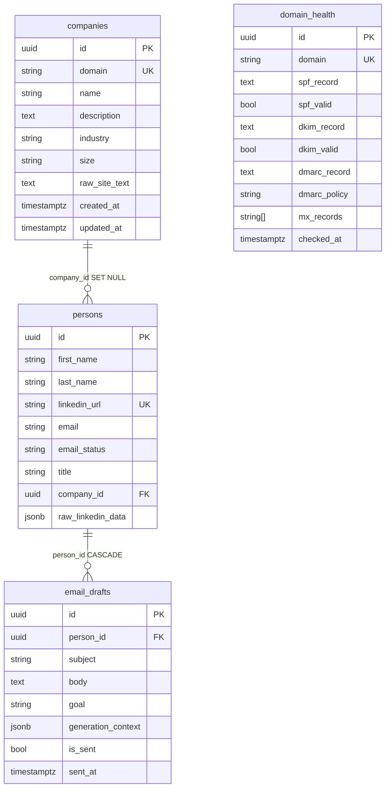

# Outreach AI Cortex — итоги дней 1–5

Шпаргалка для самопроверки и подготовки к собеседованию (дни 1–5).  
Полный итог дней 1–12: [days-1-12-summary.ru.md](days-1-12-summary.ru.md).  
Полные дни 1–8: [days-1-8-summary.ru.md](days-1-8-summary.ru.md).  
Английская версия: [days-1-5-summary.en.md](days-1-5-summary.en.md).

---

## 1. Проект в одном абзаце

B2B-outreach платформа: FastAPI + async SQLAlchemy 2.0 + PostgreSQL 16 + ChromaDB, только Docker Compose (без Kubernetes, без локальных LLM). Цель дней 1–5 — каркас данных и enrichment: CRUD компаний/людей/черновиков, парсинг сайта, LinkedIn mock/real.

**Стек:** Python 3.12, Poetry, Pydantic v2, Alembic (async), httpx, trafilatura, BeautifulSoup+lxml.  
**Железо:** 8 GB RAM → контейнеры slim, API ≤ 512 MB, никаких Ollama/PyTorch.

Базовый URL: `http://localhost:8080/api/v1`

---

## 2. Схемы для запоминания

### 2.1. Слои приложения

```text
HTTP  →  routers/     (статусы, Depends, без бизнес-логики)
      →  services/    (CRUD, research, внешние API)
      →  models/      (SQLAlchemy 2.0 Mapped)
      →  PostgreSQL

schemas/  = Pydantic вход/выход (отдельно от ORM)
core/     = Settings, engine, AsyncSession
```

Правило: роутер тонкий. Сервис получает `AsyncSession` в конструкторе (композиция, **не** наследование). Внешние адаптеры (`SiteParser`, `LinkedInService`) инжектятся — так их мокают в тестах.

### 2.2. ER-диаграмма



Каскады — истина в **БД**, не только в ORM:

| Связь | `ondelete` | Смысл |
|--------|------------|--------|
| `persons.company_id` → companies | `SET NULL` | компания удалена — контакт остаётся |
| `email_drafts.person_id` → persons | `CASCADE` | человек удалён — черновики тоже |

### 2.3. HTTP-запрос (запомнить наизусть)

```text
Клиент
  → FastAPI router (валидация Pydantic = 422)
  → Service (select / commit)
  → IntegrityError / NotFoundError / DuplicateError
  → HTTP 409 / 404 / 201 / 200 / 204
```

Семантика статусов:

| Код | Когда |
|-----|--------|
| 200 | OK, в т.ч. upsert-обновление и research с `errors[]` |
| 201 | создана новая сущность |
| 204 | DELETE, тела нет |
| 400 | валидный JSON, но доменная ошибка (редко; чаще 422) |
| 404 | **нашего** ресурса нет (компания/человек) |
| 409 | конфликт уникальности (domain, linkedin_url) |
| 422 | Pydantic / path UUID |
| 502 | апстрим неожиданно упал (сайт, LinkedIn vendor) |

404 ≠ «сайт лида лежит». Сайт лежит → 200 + `errors` (graceful degradation) или 502 только на краш.

### 2.4. Потоки research

```text
POST /companies/{domain}/research
  404 если компании нет
  SiteParser: https://{domain} + /about /product /services /solutions /pricing
  trafilatura → fallback BS4
  raw_site_text ≤ 50_000
  200 + pages_parsed + errors + duration

POST /persons/research
  422 если URL не LinkedIn /in/
  cache hit по linkedin_url → source=cache (без Phantombuster)
  иначе LinkedInService (mock | real→fallback mock)
  компания: company_domain | имя из профиля | slug + ".com"
  source = cache | mock | phantombuster
```

### 2.5. Async SQLAlchemy — три факта

1. Сессия = **Unit of Work**: копит изменения, пишет атомарно на `commit()`.
2. `expire_on_commit=False` — после commit атрибуты живы в памяти. Иначе async lazy-refresh → `MissingGreenlet`.
3. `selectinload(Person.company)` — второй `SELECT ... WHERE id IN (...)`. Без него `person.company` в async падает.

### 2.6. Enums (строки в VARCHAR, `native_enum=False`)

| Enum | Значения |
|------|----------|
| `EmailStatus` | unknown, valid, invalid, catch_all, risky |
| `CompanySize` | micro, small, medium, large, enterprise |
| `EmailGoal` | intro, follow_up, meeting, nurture, breakup |

VARCHAR проще мигрировать, чем PostgreSQL ENUM.

### 2.7. Карта API

| Метод | Путь | Статусы |
|--------|------|---------|
| GET | `/health` | 200 / 503 |
| POST/GET/PATCH/DELETE | `/companies/` , `/{domain}` | 201, 200, 204, 404, 409 |
| POST | `/companies/{domain}/research` | 200, 404, 502 |
| POST/GET/PATCH/DELETE | `/persons/` , `/{id}` | + bind `/company` |
| POST | `/persons/research` | 200, 400, 404, 422, 502 — **до** `/{id}` |
| CRUD | `/email-drafts/` + `/mark-sent` | 201, 200, 204, 404 |
| upsert | `/deliverability/` | 201 create / 200 update |

---

## 3. День 1 — каркас

**Сделано:** Docker Compose (api:8080, postgres:5432, chroma:8000), Poetry, FastAPI + lifespan, `Settings`, async engine, `GET /health`.

**Запомнить:** health проверяет зависимости, не «процесс жив». `depends_on: service_healthy`. Секреты только в `.env`.

### Самопроверка (день 1)

1. **Зачем lifespan?**  
   На старте `SELECT 1` — fail fast, если Postgres недоступен. На стопе `engine.dispose()` — пул не течёт.

2. **Почему python:3.12-slim, не alpine?**  
   musl ломает колёса asyncpg. Slim = glibc.

3. **Зачем `pool_pre_ping`?**  
   Отброшенное соединение (idle timeout) не отдаёт клиенту 500 — драйвер проверяет сокет.

---

## 4. День 2 — модели, Alembic, CRUD компаний

**Сделано:** `Base` + `UUIDMixin` + `TimestampMixin`; модели Company/Person/EmailDraft/DomainHealth; async `alembic/env.py`; схемы Company*; `CompanyService`; CRUD `/companies`.

`alembic.ini` **не** подставляет `${PASSWORD}` — URL берётся из `Settings.database_url` в `env.py`.

### Самопроверка (день 2)

1. **Почему переписывать `env.py` под async?**  
   Дефолт — sync `Engine.connect()`. asyncpg так нельзя: нужен `asyncio.run` + `connection.run_sync`.

2. **`relationship` vs `ForeignKey`?**  
   FK — колонка и constraint в БД. relationship — навигация в Python. `back_populates` синхронизирует обе стороны в сессии.

3. **Что делает `--autogenerate`?**  
   Diff `Base.metadata` ↔ живая схема. Не видит rename (думает drop+create). Файл всегда читают глазами.

4. **Зачем `field_validator` на domain?**  
   Срезает `https://`, `www.`, path. Иначе `https://acme.com` и `acme.com` — два уникальных ключа.

5. **Почему сервис, не логика в роутере?**  
   Тесты без TestClient, тот же сервис из job/CLI, роутер остаётся про HTTP.

6. **409 или 400 на дубликат?**  
   **409 Conflict** — запрос валидный, состояние БД против. 400 — кривой запрос. Гонка двух POST ловится unique + `IntegrityError`.

7. **Что смотреть в логах при 500?**  
   Traceback uvicorn (файл, строка), не статус healthcheck.

### Собеседование (день 2)

1. **Unit of Work?**  
   Сессия копит INSERT/UPDATE/DELETE и применяет одной транзакцией на `commit()`. `rollback()` отменяет unit.

2. **Lazy vs Eager?**  
   Lazy — SELECT при доступе к связи (в async опасно). Eager (`selectinload` / `joinedload`) — когда связь точно нужна.

3. **Не закрыть async-сессию?**  
   Соединение не вернётся в пул → пул исчерпается, API повиснет на checkout.

4. **Два параллельных CREATE?**  
   Check-then-insert гонка. Нужен unique + `IntegrityError` → 409.

5. **`expire_on_commit=False`?**  
   Sync-сессия после commit помечает атрибуты expired → lazy refresh. В async refresh ломается. Флаг оставляет значения в памяти.

---

## 5. День 3 — Person, EmailDraft, DomainHealth

**Сделано:** схемы *Create/*Update/*Response/*WithX; сервисы; роутеры; `selectinload` на детальных GET; upsert deliverability (201/200).

`PersonWithCompanyResponse` отдельно от `PersonResponse`, чтобы список не тащил вложенную компанию.

Prefix `/deliverability` — capability, не имя таблицы `domain_health`.

### Самопроверка (день 3)

1. **Зачем отдельная схема с `company`?**  
   Список лёгкий; детальный GET явно просит связь. Минус вложенности: жирный JSON, риск циклов, лишние SELECT.

2. **Что такое `selectinload`?**  
   Eager вторым IN-запросом. Без него async lazy → `MissingGreenlet`. `joinedload` — один JOIN, хуже на коллекциях (декартово).

3. **`sent_at` в Python vs `now()` в БД?**  
   Плюс: UTC приложения, проще тесты. Минус: часы API и Postgres могут разъехаться.

4. **Чем upsert лучше create+update?**  
   Клиенту не нужно знать, есть ли ряд. Повторный DNS-чек идемпотентен. На гонке: `IntegrityError` → update.

5. **Почему `/deliverability`, не `/domain-health`?**  
   URL — контракт продукта. Таблицу можно переименовать.

6. **502 vs 404, если сайт мёртв?**  
   404 = нет **нашей** записи. 502 = апстрим. Известный dead host у парсера — 200 + `errors`.

### Собеседование (день 3)

1. **N+1?**  
   Цикл по списку + lazy SELECT на каждую связь. Лечится `selectinload`/`joinedload`, не `for p in people: p.company`.

2. **Lazy / Eager / Selectin?**  
   Lazy — при доступе. Joined — один JOIN. Selectin — второй IN, лучше для коллекций.

3. **Каскады?**  
   FK `ondelete` — истина в БД. ORM `cascade="all, delete-orphan"` — поведение сессии, не замена FK.

4. **Upsert?**  
   Postgres: `INSERT ... ON CONFLICT (domain) DO UPDATE`. У нас get+create/update + unique. Для высоких гонок — `ON CONFLICT`.

5. **Проверка FK в транзакции?**  
   Check и INSERT в одной сессии: иначе TOCTOU. Страховка — сам FK в Postgres.

---

## 6. День 4 — парсер сайта

**Сделано:** `ParserSettings`; `SiteParser` (httpx retry 0.5/1/2s, trafilatura + BS4, follow_links, SSRF-гард localhost); `CompanyService.research`; `POST /{domain}/research`; pytest с моками.

Почему пакеты: **httpx** — async; **trafilatura** — основной текст; **BS4+lxml** — title/meta и fallback.

### Самопроверка (день 4)

1. **Почему httpx, не requests?**  
   `requests.get` блокирует worker на весь timeout. httpx отдаёт loop другим запросам.

2. **Зачем `max_text_length=50000`?**  
   Потолок под RAG/эмбеддинги. Без лимита один HTML забьёт RAM контейнера и Postgres.

3. **Graceful degradation?**  
   Главная недоступна → `ParseResult` с `errors`, не exception. Компания в БД жива.

4. **Зачем инжектить `SiteParser`?**  
   `CompanyService(db, parser=FakeParser())` без сети.

5. **Зачем `errors` в ответе, не exception?**  
   `/pricing` часто 404, главная жива — частичный успех. 502 только на краш.

6. **Порядок `/{domain}` и `/{domain}/research`?**  
   Разный шаблон (лишний сегмент), конфликта почти нет. Статический `/research` как отдельный список нужно регистрировать **до** `/{domain}`.

7. **Почему моки в тестах парсера?**  
   Детерминизм, скорость, нет бана stripe.com из CI.

### Собеседование (день 4)

1. **Retry?**  
   Exponential backoff на timeout/5xx/429. Не ретраить 404/400. Потолок + jitter.

2. **Graceful degradation — пример?**  
   Сайт лида лежит → 200 + пустой `raw_site_text` + `errors[]`. Outreach CRUD не падает.

3. **SSRF?**  
   Не принимать произвольный URL. Собирать `https://{нормализованный_domain}{allowlist}`. Резать localhost, `169.254.169.254`, private CIDR, опасные редиректы.

4. **Почему trafilatura лучше наивного BS4?**  
   Article extraction без меню/cookie-banner. BS4 по всем `<p>` тащит boilerplate.

5. **Кэш парсинга?**  
   Ключ domain + hash текста / `checked_at`. Не парсить, если свежее N часов; ETag; не переэмбеддить тот же текст.

---

## 7. День 5 — LinkedIn mock / real

**Сделано:** `LinkedInSettings`; `LinkedInService`; `PersonService.research_from_linkedin`; `POST /persons/research` **перед** `/{person_id}`; cache по unique URL; README + `linkedin-mock-vs-real.md`.

```
mock:  sha256(username) → стабильный фейк + sleep
real:  POST /agents/launch → poll fetch-output 3s × 20
       ошибка/пустой ключ → fallback mock + warning
cache: SELECT по linkedin_url → source=cache, без адаптера
```

Компания: явный domain (404 если нет) → имя профиля (ilike) → `slugify(name) + ".com"`.

### Самопроверка (день 5)

1. **Почему хэш, не random?**  
   Идемпотентные тесты и демо. Random спрячет баг «тот же URL дважды».

2. **Почему cache, не update?**  
   Кредиты Phantombuster; стабильный снимок для писем. Refresh — отдельный force-флаг.

3. **Почему `/research` раньше `/{person_id}`?**  
   Иначе `"research"` валидируется как UUID → 422.

4. **Зачем `get_linkedin_service()`, не `LinkedInService()` в роутере?**  
   Одна сборка из settings. Инжект в конструктор проще, чем `Depends` на сервис+сессию.

5. **Что доказывает тест идемпотентности?**  
   Один URL = один `person.id`. Хэш это гарантирует и в mock.

6. **Unit vs integration?**  
   Unit — хэш, username, sleep, без I/O. Integration — роутер + unique + БД. Real-путь в unit мокают.

7. **Почему не свой Selenium?**  
   ToS LinkedIn, бан, SSRF, не влезает в 512 MB. Phantombuster — ключ и кредиты; риск всё ещё есть, prod держим `LINKEDIN_MODE=mock` до sign-off.

### Собеседование (день 5)

1. **429?**  
   Retry-After / exponential backoff + jitter, бюджет попыток, потом fallback. Circuit breaker на серии 429.

2. **Идемпотентность?**  
   Повтор не создаёт вторую сущность и не списывает кредит. Unique URL + cache.

3. **Sync vs async к внешнему API?**  
   Polling минутами: sync `requests` заморозит worker. Нужен `httpx.AsyncClient` + `asyncio.sleep`.

4. **Legal/ethical LinkedIn?**  
   ToS, GDPR/PII, минимум полей, право на удаление, не логировать сырой профиль. Vendor + DPA лучше самодельного скрейпа.

5. **Кэш кредитов?**  
   Сначала SELECT. TTL/`researched_at`. Не запускать phantom, пока cache свежий.

---

## 8. Типичные ловушки (шпаргалка)

| Ловушка | Как правильно |
|---------|----------------|
| `CompanyService(AsyncSession)` наследованием | Композиция: `__init__(self, db)` |
| Lazy load в async | `selectinload` / `joinedload` |
| `GET /{id}` съедает `/research` | Статический путь **выше** param |
| Дубликат без unique в БД | Check в сервисе **и** constraint |
| Sync HTTP в FastAPI | Только httpx async |
| `${PASSWORD}` в alembic.ini | URL из Settings в `env.py` |
| `--autogenerate` в прод без ревью | Всегда читать revision |
| Exception на мёртвый сайт | 200 + `errors` |
| `random` в mock | `sha256(username)` |
| ASGITransport + глобальный engine в pytest | Новый event loop ≠ старый pool → HTTP к uvicorn или session loop |

---

## 9. Команды

```bash
docker compose build api
docker compose up -d
docker compose exec api poetry run alembic upgrade head
curl http://localhost:8080/api/v1/health
docker compose exec api poetry run pytest -v
```

Research:

```bash
curl -s -X POST http://localhost:8080/api/v1/companies/ \
  -H "Content-Type: application/json" \
  -d '{"domain":"stripe.com","name":"Stripe"}'
curl -s -X POST http://localhost:8080/api/v1/companies/stripe.com/research

curl -s -X POST http://localhost:8080/api/v1/persons/research \
  -H "Content-Type: application/json" \
  -d '{"linkedin_url":"https://linkedin.com/in/johndoe"}'
```

---

## 10. Материалы

| Тема | Ссылка |
|------|--------|
| SQLAlchemy 2.0 Mapped | https://docs.sqlalchemy.org/en/20/orm/mapping_styles.html |
| Relationships / loading | https://docs.sqlalchemy.org/en/20/orm/relationships.html · https://docs.sqlalchemy.org/en/20/orm/loading_relationships.html |
| Alembic async | https://alembic.sqlalchemy.org/en/latest/cookbook.html |
| FastAPI SQL / Testing | https://fastapi.tiangolo.com/tutorial/sql-databases/ · https://fastapi.tiangolo.com/tutorial/testing/ |
| Pydantic validators | https://docs.pydantic.dev/latest/concepts/validators/ |
| httpx async | https://www.python-httpx.org/async/ |
| trafilatura / BS4 | https://trafilatura.readthedocs.io · https://www.crummy.com/software/BeautifulSoup/bs4/doc/ |
| pytest-asyncio | https://pytest-asyncio.readthedocs.io |
| hashlib / asyncio.sleep | Python stdlib |
| Phantombuster API | https://hub.phantombuster.com/reference |
| Mock vs real (наш разбор) | [linkedin-mock-vs-real.md](linkedin-mock-vs-real.md) |

---

## 11. Сводка дней

| День | Коммит (префикс) | Суть |
|------|------------------|------|
| 1 | bootstrap FastAPI + PG + Chroma | каркас, health |
| 2 | `[MODELS]` | ORM, Alembic async, CRUD companies |
| 3 | `[CRUD]` | persons, drafts, deliverability, связи |
| 4 | `[PARSER]` | site research, trafilatura, тесты |
| 5 | `[LINKEDIN]` | mock/real, persons/research, cache |

Дальше по плану продукта: чанки `raw_site_text` + LinkedIn snapshot в Chroma и генерация письма (только cloud LLM).
