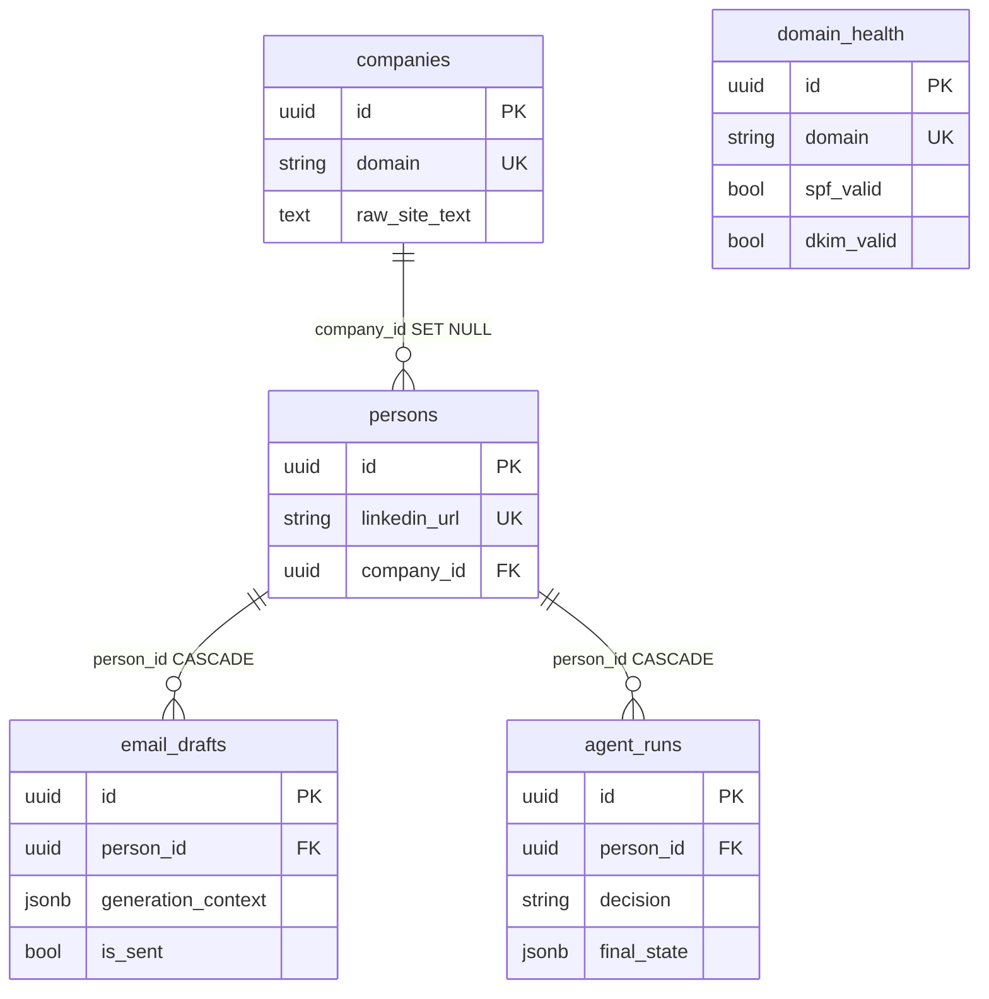
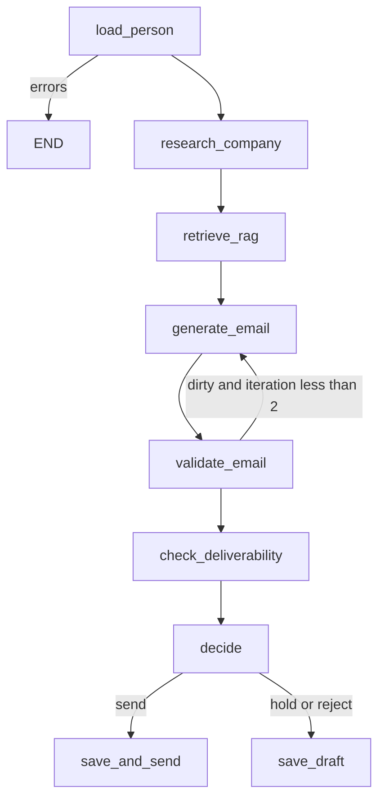

# Outreach AI Cortex — Days 1–8 recap

Study sheet: self-check questions, diagrams to memorize, interview prep.  
Russian: [days-1-8-summary.ru.md](days-1-8-summary.ru.md).  
Shorter Days 1–5 only: [days-1-5-summary.en.md](days-1-5-summary.en.md).

**Stack:** Python 3.12, FastAPI, SQLAlchemy 2.0 async, PostgreSQL 16, ChromaDB, Poetry, Docker Compose.  
**Hardware:** 8 GB RAM, Intel Iris Xe 128 MB VRAM — **no local LLMs** (Ollama / PyTorch / transformers). Embeddings and chat are cloud-only; `*_MODE=mock` for CI.  
**Base URL:** `http://localhost:8080/api/v1`

---

## 1. The project in one paragraph

B2B outreach: company + person → site parse → Chroma chunks → personalized email (GPT-4o-mini) → LangGraph decides hold/send/reject. No Kubernetes. Secrets stay in `.env`.

| Day | Outcome |
|-----|---------|
| 1 | Compose, FastAPI, health, Settings |
| 2 | Models, async Alembic, company CRUD |
| 3 | Person, EmailDraft, DomainHealth |
| 4 | SiteParser + `POST .../research` |
| 5 | LinkedIn mock/real + `POST /persons/research` |
| 6 | RAG: splitter, embeddings, Chroma, `/context` |
| 7 | LLMClient, EmailGenerator, `POST .../generate-email` |
| 8 | LangGraph agent, `POST /agent/outreach`, `agent_runs` |

---

## 2. Diagrams to memorize

### 2.1. Layers

```text
HTTP  →  routers/     status codes, Depends, no business logic
      →  services/    CRUD, research, RAG, LLM, graph
      →  models/      SQLAlchemy 2.0 Mapped
      →  PostgreSQL

schemas/  = Pydantic (not the ORM)
core/     = Settings, engine, AsyncSession
```

Services take `AsyncSession` in `__init__` (**composition, not inheritance**). Adapters (`SiteParser`, `LinkedInService`, `LLMClient`) are injected so tests can fake them.

### 2.2. ER



| Relation | `ondelete` | Meaning |
|----------|------------|---------|
| persons → companies | `SET NULL` | company gone, contact stays |
| email_drafts → persons | `CASCADE` | person gone, drafts gone |
| agent_runs → persons | `CASCADE` | same for agent history |

Cascades live in the **database**, not only in the ORM.

### 2.3. HTTP semantics

| Code | When |
|------|------|
| 200 | OK, research with `errors[]`, upsert update |
| 201 | new row |
| 204 | DELETE, empty body |
| 400 | e.g. person_id mismatch |
| 404 | **our** resource is missing |
| 409 | unique conflict |
| 422 | Pydantic |
| 502 | upstream (site, LLM, LinkedIn) |
| 503 | health: Postgres or Chroma down |

A dead prospect site is not 404. It is 200 + `errors` (graceful degradation).

### 2.4. Product pipeline

```text
Company + Person
    → POST /companies/{domain}/research
         parse → raw_site_text → chunk → embed → Chroma company_{domain}
    → POST /persons/{id}/generate-email
         RAG search → prompt → LLM JSON → validate → EmailDraft
    → POST /agent/outreach
         StateGraph: load → research? → RAG → generate → validate
         → deliverability → decide → save | save_and_send (stub)
```

### 2.5. RAG (Day 6)

```text
raw_site_text
  → cap 1M chars
  → RecursiveCharacterTextSplitter 1000/200
  → drop chunks < 50
  → embed: mock HashEmbedder | real text-embedding-3-small (cloud)
  → Chroma collection company_{domain}  cosine HNSW
  → GET /companies/{domain}/context?q=
```

`text-embedding-3-small` (1536d) is cheaper than `large`. `RAG_MODE=mock` is hash vectors — **not** a local neural net.

### 2.6. Email (Day 7)

```text
system  = style contract (one CTA, no spam, no "I hope this email…")
user    = lead + RAG + sender + goal
LLM     = chat_json → {"subject","body"}
          strip fences; else ValueError
validator → 1 retry → save anyway + validation_errors
```

Sender (`name/title/company`) is request-scoped, not a User table.

### 2.7. Agent (Day 8)



Default `AGENT_REQUIRE_HUMAN_APPROVAL=true` → **hold** even on a clean draft. `save_and_send` only stubs `mark_sent` (SMTP is Day 10).

`thread_id` = `{person_id}:{uuid4()}` — never bare `person_id`, or a second run resumes a stale checkpoint.

### 2.8. Three async SQLAlchemy facts

1. Session = Unit of Work; writes atomically on `commit()`.
2. `expire_on_commit=False` — otherwise async lazy refresh → `MissingGreenlet`.
3. `selectinload` — second `SELECT ... IN (...)`. Without it, `person.company` dies in async.

### 2.9. Enums (`native_enum=False` → VARCHAR)

| Enum | Values |
|------|--------|
| EmailStatus | unknown, valid, invalid, catch_all, risky |
| CompanySize | micro … enterprise |
| EmailGoal | intro, follow_up, meeting, demo, nurture, breakup |

---

## 3. Day 1 — bootstrap

Docker Compose (api:8080, postgres:5432, chroma:8000), Poetry, FastAPI + lifespan, `Settings`, `GET /health`.

### Self-check

1. **Why lifespan?** Startup `SELECT 1` fails fast. Shutdown `engine.dispose()`.
2. **Why slim, not alpine?** musl breaks asyncpg wheels.
3. **Why `pool_pre_ping`?** A dead idle socket must not 500 the client.

### Interview

Health checks **dependencies**, not “the process is up”. `depends_on: service_healthy`. Secrets stay out of the image.

---

## 4. Day 2 — models and company CRUD

`Base` + mixins, async Alembic `env.py`, `CompanyService`, `/companies` CRUD. Migration URL from `Settings`, not `${PASSWORD}` in ini.

### Self-check

1. **Why rewrite `env.py` for async?** Default is sync `Engine.connect()`. asyncpg needs `asyncio.run` + `run_sync`.
2. **`relationship` vs `ForeignKey`?** FK is the DB constraint; relationship is Python. `back_populates` keeps the session in sync.
3. **`--autogenerate`?** Diff metadata ↔ live schema. Misses renames. Always read the file.
4. **Domain validator?** Strips `https://`, `www.`, path — otherwise two unique keys.
5. **Why a service, not router logic?** Tests without TestClient; same code from a job/CLI.
6. **409 or 400 on duplicate?** 409 — request is valid, DB state is not. Races: unique + `IntegrityError`.

### Interview

1. **Unit of Work?** Session buffers changes; `commit()` applies them; `rollback()` drops the unit.
2. **Lazy vs eager?** Lazy is unsafe in async. Use `selectinload` / `joinedload` when you need the relation.
3. **Forgot to close the session?** Pool exhaustion; API hangs on checkout.
4. **`expire_on_commit=False`?** Sync sessions expire attributes after commit (lazy refresh). That refresh breaks under async.

---

## 5. Day 3 — Person, Draft, Deliverability

Separate list vs detail schemas (`PersonWithCompanyResponse`). Prefix `/deliverability` is a capability, not the table name.

### Self-check

1. **Why a schema without `company` on the list?** Smaller JSON, fewer SELECTs, no cycles.
2. **`selectinload`?** Eager via a second IN query. `joinedload` is one JOIN; worse on collections.
3. **`sent_at` in the app?** Process UTC, easier tests; clocks can drift vs Postgres.
4. **Why upsert?** Client need not know if the row exists. Idempotent DNS re-check.
5. **502 vs 404 if the site is dead?** 404 = **our** row is missing.

### Interview

1. **N+1?** Loop + lazy SELECT. Fix with selectin/joined, not `for p in people: p.company`.
2. **Cascades?** `ondelete` in the DB is source of truth. ORM cascade is session behavior.
3. **Real upsert?** `INSERT ON CONFLICT`. We do get+create/update + unique.

---

## 6. Day 4 — site parser

httpx + 0.5/1/2s retry, trafilatura, BS4 fallback, SSRF guard, `raw_site_text` ≤ 50k.

### Self-check

1. **Why httpx, not requests?** Sync `get` blocks the worker for the whole timeout.
2. **Why a text cap?** RAG/embeddings and container RAM.
3. **Graceful degradation?** Homepage down → `ParseResult` + `errors`, company row stays.
4. **Inject the parser?** `CompanyService(db, parser=Fake)` with no network.
5. **Why `errors` on 200?** `/pricing` is often 404 while the homepage works.
6. **Why mocks?** Determinism; no CI ban from stripe.com.

### Interview

1. **Retry?** Backoff on timeout/5xx/429. Do not retry 404. Jitter + a cap.
2. **SSRF?** Never take a raw URL. Allowlisted paths; block localhost / metadata / private CIDR.
3. **Why trafilatura?** Main-content extraction. Naive BS4 pulls nav/footer chrome.

---

## 7. Day 5 — LinkedIn

```text
mock:  sha256(username) + sleep
real:  Phantombuster launch + poll → fallback mock
cache: unique linkedin_url → source=cache
```

Register `POST /persons/research` **before** `/{person_id}`.

### Self-check

1. **Why hash, not random?** Idempotent tests; same URL = same fake profile.
2. **Why cache, not update?** Vendor credits; refresh is a separate flag.
3. **Why `/research` before `/{id}`?** Otherwise `"research"` is a 422 UUID.
4. **Why not home-grown Selenium?** ToS, bans, RAM. Vendor + DPA.
5. **Idempotency?** One URL = one `person.id`.

### Interview

1. **429?** Honor Retry-After / backoff + jitter, then fallback. Circuit-break a streak.
2. **Sync poll for minutes?** Freezes the worker — only async httpx + `asyncio.sleep`.
3. **Legal?** ToS, GDPR/PII, minimum fields, do not log raw profiles.

---

## 8. Day 6 — RAG / Chroma

`CompanyTextSplitter`, `RAGService`, `get_chroma_client` + `@lru_cache`, health via that client, `chunks_indexed`, `GET /{domain}/context`. An empty crawl **does not wipe** `raw_site_text`. A RAG failure does not 502 research.

### Self-check

1. **Why `text-embedding-3-small`, not large?** Pet-project cost and 1536d beat max retrieval.
2. **Why `@lru_cache` on HttpClient?** Handshake per request burns sockets. Reset after a failed health ping.
3. **Why overlap 200?** So a sentence is not split across chunks — better retrieval.
4. **Why no local model?** 8 GB / 128 MB VRAM. Mock is a hash, not a net.
5. **Why tiktoken?** Token estimate **before** the paid API call.
6. **Why delete+recreate the collection?** Re-research must not duplicate chunks.

### Interview

1. **Chunk size vs overlap?** Larger chunks = more context, less precision; overlap heals cuts.
2. **Cosine vs L2?** For normalized embeddings, cosine is “how similar”.
3. **How not to burn embedding budget?** Cache by text hash; do not re-index identical text; use small.
4. **Collection isolation?** `company_{domain}` is a simple tenant. Metadata filters are the alternative.

---

## 9. Day 7 — email generation

`LLMSettings` (`default_model` / `premium_model`), prompts, `LLMClient` (retry + JSON), `EmailGenerator`, `OutputValidator`, `POST /persons/{id}/generate-email`, `CostTracker`. LLM health = key present, not a chat call.

### Self-check

1. **Why two model fields?** mini for prompt iteration; 4o in prod once the template is stable.
2. **Why sender from the client?** No User table; multi-sender; easier tests.
3. **Why JSON, not prose?** Two columns. Bad JSON: strip fences → `loads` → else 502.
4. **Backoff vs sleep(1)?** Do not hammer the same rate limit in the same second.
5. **Why regenerate instead of deleting “free”?** “free up your ops time” is legitimate copy.
6. **Why `generation_context`?** Replay RAG/model/tokens without another LLM call.
7. **`lru_cache` on Settings?** Otherwise every request re-parses `.env`.
8. **How do you know RAG landed?** Body cites a chunk fact that is not in the lead’s title.
9. **Invalid draft or 500?** Save + `validation_errors`. Editing beats an empty 500.
10. **What to mock?** Client unit tests: `AsyncOpenAI.create`. Endpoint: `generate` / `chat_json`. `LLM_MODE=mock` in the container.
11. **Why no LLM call in health?** Cost and flaky 503s. Check the key.

### Interview

1. **System vs user?** System is the contract for every call. User is this lead, RAG, sender.
2. **Temperature?** →0 stable JSON; 0.7 livelier copy; 1+ hallucinations.
3. **Valid JSON?** `response_format=json_object` + strip fences. Do not parse “first line is the subject”.
4. **Token limit?** Prompt `top_k` chunks, not all of `raw_site_text`. Long docs → map-reduce.
5. **Quality without a human?** Spam/forbidden/CAPS, length, overlap with RAG, one CTA. Reply rate is a product metric.

---

## 10. Day 8 — LangGraph agent

Deterministic graph: the LLM writes the email; it does **not** choose to skip DKIM. In-process `MemorySaver`; `langgraph-checkpoint-postgres` is a later lifespan concern. Audit trail is `agent_runs.final_state`.

### Self-check

1. **Why human_approval?** Without it, stub `mark_sent` fires on a hallucination. Dev default is true.
2. **`Annotated[list, add]`?** Concat across nodes. Without a reducer, last write wins. **`validation_errors` overwrites** so a clean regen can proceed.
3. **Why is send a stub?** No SMTP, queue, idempotency, or unsubscribe yet.
4. **Why persist rejects?** Prompt and validator analytics.
5. **What is a checkpointer?** A state snapshot. Resume with the same `thread_id`.
6. **Why not `thread_id=person_id`?** A second outreach would merge old errors/iteration.
7. **Why `decision_reason`?** Hold for DKIM ≠ hold for approval.
8. **Why `final_state`?** MemorySaver dies with the process; the Postgres row does not.
9. **Timeout mid-graph?** Without a Postgres saver, rerun. With one, resume the thread.
10. **How to test without spend?** Fake `EmailGenerator` / RAG / drafts. Edges are pure functions.
11. **Why a graph picture?** Branches are invisible in linear `nodes.py`.

### Interview

1. **LangGraph vs AgentExecutor?** A graph encodes policy in code. An executor lets the model pick tools. Outreach = graph.
2. **Checkpointer / resume?** Snapshot after a node; same `thread_id`. A new run needs a new id.
3. **Infinite loops?** `iteration` + `recursion_limit` + “after one regen, continue”.
4. **Reducer?** `add` concatenates lists. Dangerous if you must forget a prior error.
5. **Mocking strategy?** Mock leaves (LLM, Chroma), not the whole `ainvoke`, if the graph compiles on fakes.

---

## 11. Typical traps

| Trap | Fix |
|------|-----|
| Service subclasses `AsyncSession` | `__init__(self, db)` |
| Lazy load in async | `selectinload` |
| `GET /{id}` eats `/research` | Static path **first** |
| Duplicate without a unique constraint | App check **and** DB constraint |
| Sync HTTP in FastAPI | async httpx |
| Exception on a dead site | 200 + `errors` |
| `random` in LinkedIn mock | `sha256(username)` |
| ASGITransport + global engine | HTTP to uvicorn or a session loop |
| Local LLM “for simplicity” | Forbidden on this hardware |
| New Chroma client per request | `@lru_cache` + reset |
| Research wipes old text | Write `raw_site_text` only if parse is non-empty |
| Strip spam tokens from the body | Regenerate |
| 500 on a dirty draft | Save + `validation_errors` |
| LLM inside health | Config only |
| `thread_id=person_id` | `{person_id}:{uuid4()}` |
| `add` on `validation_errors` | Overwrite after regen |
| `human_approval=false` in dev | Accidental auto-send stub |

---

## 12. API map

| Method | Path | Role |
|--------|------|------|
| GET | `/health` | PG + Chroma + LLM config |
| * | `/companies/` | CRUD + research + context |
| * | `/persons/` | CRUD + research + generate-email |
| * | `/email-drafts/` | CRUD + mark-sent |
| * | `/deliverability/` | SPF/DKIM upsert |
| POST | `/agent/outreach` | graph |
| GET | `/agent/runs` | history |

---

## 13. Commands

```bash
cp .env.example .env
docker compose build api
docker compose up -d
docker compose exec api poetry run alembic upgrade head
curl http://localhost:8080/api/v1/health
docker compose exec api poetry run pytest -v
```

Full loop (mock LLM / RAG / LinkedIn):

```bash
curl -s -X POST http://localhost:8080/api/v1/companies/ \
  -H "Content-Type: application/json" \
  -d '{"domain":"stripe.com","name":"Stripe"}'
curl -s -X POST http://localhost:8080/api/v1/companies/stripe.com/research
curl -s -X POST http://localhost:8080/api/v1/persons/research \
  -H "Content-Type: application/json" \
  -d '{"linkedin_url":"https://linkedin.com/in/johndoe","company_domain":"stripe.com"}'
# person_id from the response:
curl -s -X POST http://localhost:8080/api/v1/persons/{id}/generate-email \
  -H "Content-Type: application/json" \
  -d '{"person_id":"{id}","goal":"meeting","sender_name":"Kirill","sender_title":"Founder","sender_company":"AI Cortex"}'
curl -s -X POST http://localhost:8080/api/v1/agent/outreach \
  -H "Content-Type: application/json" \
  -d '{"person_id":"{id}","goal":"meeting","sender_name":"Kirill","sender_title":"Founder","sender_company":"AI Cortex"}'
```

Default agent expectation: `decision=hold`, `awaiting approval`.

---

## 14. Interview question bank (skim before a call)

**Backend / SQLAlchemy:** Unit of Work, expire_on_commit, selectinload vs N+1, 409 vs unique, async session leak, async Alembic env.

**HTTP / API design:** thin router, 404 vs 502, graceful degradation, static path before `{id}`, capability URL (`/deliverability`).

**Parsing / integrations:** httpx vs requests, SSRF, retry/backoff, mock vs real, cache idempotency, LinkedIn ToS.

**RAG:** chunk/overlap, cosine, small vs large embeddings, collection isolation, token cost, why no local model.

**LLM:** system/user, temperature, JSON mode, token limits, quality without a human, why health must not chat.

**Agents:** graph vs AgentExecutor, reducers, checkpointer, loops, human-in-the-loop, what to mock.

---

## 15. Reading list

| Topic | Link |
|-------|------|
| SQLAlchemy 2.0 / loading | https://docs.sqlalchemy.org/en/20/orm/loading_relationships.html |
| Alembic async | https://alembic.sqlalchemy.org/en/latest/cookbook.html |
| FastAPI | https://fastapi.tiangolo.com/tutorial/sql-databases/ |
| httpx | https://www.python-httpx.org/async/ |
| OpenAI text / prompts | https://platform.openai.com/docs/guides/text-generation · https://platform.openai.com/docs/guides/prompt-engineering |
| OpenRouter | https://openrouter.ai/docs |
| LangGraph | https://langchain-ai.github.io/langgraph/concepts/ |
| Checkpointing | https://langchain-ai.github.io/langgraph/concepts/persistence/ |
| Our LinkedIn note | [linkedin-mock-vs-real.md](linkedin-mock-vs-real.md) |
| Email prompts | [llm-prompt-engineering-for-outreach.md](llm-prompt-engineering-for-outreach.md) · [PROMPTS.md](../PROMPTS.md) |
| LangGraph vs agents | [langgraph-vs-langchain-agents.md](langgraph-vs-langchain-agents.md) |
| Agent diagram | [docs/agent_graph.mmd](../docs/agent_graph.mmd) |

---

## 16. Commit map

| Day | Message prefix |
|-----|----------------|
| 1 | bootstrap FastAPI + PG + Chroma |
| 2 | `[MODELS]` |
| 3 | `[CRUD]` |
| 4 | `[PARSER]` |
| 5 | `[LINKEDIN]` |
| 6 | `[RAG]` |
| 7 | `[LLM]` |
| 8 | `[AGENT]` |

Next on the product path: real SMTP (Day 10), lifespan-owned Postgres checkpointer, LinkedIn force-refresh, email quality (LLM-as-judge / reply rate).
