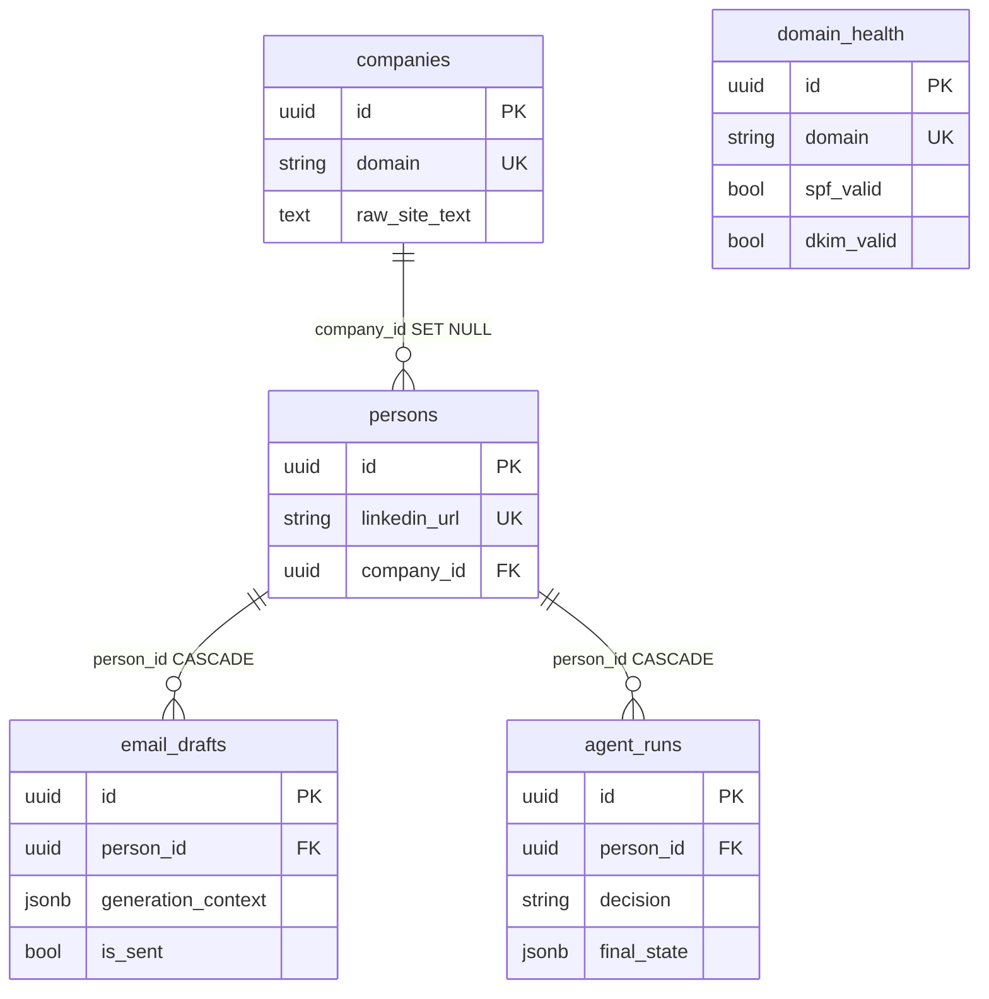
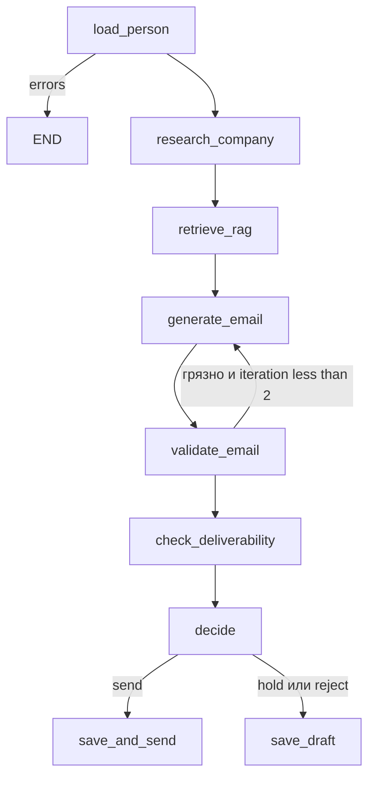

# Outreach AI Cortex — итоги дней 1–8

Шпаргалка для самопроверки, схем на запоминание и подготовки к собеседованию.  
English: [days-1-8-summary.en.md](days-1-8-summary.en.md).  
Дни 1–5 отдельно (короче): [days-1-5-summary.ru.md](days-1-5-summary.ru.md).

**Стек:** Python 3.12, FastAPI, SQLAlchemy 2.0 async, PostgreSQL 16, ChromaDB, Poetry, Docker Compose.  
**Железо:** 8 GB RAM, Intel Iris Xe 128 MB VRAM — **никаких локальных LLM** (Ollama / PyTorch / transformers). Эмбеддинги и chat только через облако; `*_MODE=mock` для CI.  
**Базовый URL:** `http://localhost:8080/api/v1`

---

## 1. Проект в одном абзаце

B2B-outreach: карточка компании и лида → парсинг сайта → чанки в Chroma → персональное письмо (GPT-4o-mini) → LangGraph решает hold/send/reject. Без Kubernetes. Секреты только в `.env`.

| День | Суть |
|------|------|
| 1 | Compose, FastAPI, health, Settings |
| 2 | Модели, Alembic async, CRUD companies |
| 3 | Person, EmailDraft, DomainHealth |
| 4 | SiteParser + `POST .../research` |
| 5 | LinkedIn mock/real + `POST /persons/research` |
| 6 | RAG: splitter, embeddings, Chroma, `/context` |
| 7 | LLMClient, EmailGenerator, `POST .../generate-email` |
| 8 | LangGraph-агент, `POST /agent/outreach`, `agent_runs` |

---

## 2. Схемы для запоминания

### 2.1. Слои

```text
HTTP  →  routers/     статусы, Depends, без бизнес-логики
      →  services/    CRUD, research, RAG, LLM, граф
      →  models/      SQLAlchemy 2.0 Mapped
      →  PostgreSQL

schemas/  = Pydantic (не ORM)
core/     = Settings, engine, AsyncSession
```

Сервис получает `AsyncSession` в конструкторе (**композиция, не наследование**). Адаптеры (`SiteParser`, `LinkedInService`, `LLMClient`) инжектятся — так их мокают.

### 2.2. ER



| Связь | `ondelete` | Смысл |
|--------|------------|--------|
| persons → companies | `SET NULL` | компания удалена — контакт жив |
| email_drafts → persons | `CASCADE` | человек удалён — черновики тоже |
| agent_runs → persons | `CASCADE` | то же для истории агента |

Каскад — истина в **БД**, не только в ORM.

### 2.3. HTTP-семантика

| Код | Когда |
|-----|--------|
| 200 | OK, research с `errors[]`, upsert-обновление |
| 201 | новая сущность |
| 204 | DELETE без тела |
| 400 | person_id mismatch и т.п. |
| 404 | **нашего** ресурса нет |
| 409 | unique conflict |
| 422 | Pydantic |
| 502 | апстрим (сайт, LLM, LinkedIn) |
| 503 | health: Postgres или Chroma down |

Сайт лида лежит ≠ 404. Это 200 + `errors` (graceful degradation).

### 2.4. Пайплайн продукта

```text
Company + Person
    → POST /companies/{domain}/research
         parse site → raw_site_text → chunk → embed → Chroma company_{domain}
    → POST /persons/{id}/generate-email
         RAG search → prompt → LLM JSON → validate → EmailDraft
    → POST /agent/outreach
         StateGraph: load → research? → RAG → generate → validate
         → deliverability → decide → save | save_and_send (stub)
```

### 2.5. RAG (день 6)

```text
raw_site_text
  → truncate 1M chars
  → RecursiveCharacterTextSplitter 1000/200
  → drop chunks < 50
  → embed: mock HashEmbedder | real text-embedding-3-small (облако)
  → Chroma collection company_{domain}  cosine HNSW
  → GET /companies/{domain}/context?q=
```

`text-embedding-3-small` (1536d) дешевле `large`. `RAG_MODE=mock` — hash-векторы, **не** локальная нейросеть.

### 2.6. Письмо (день 7)

```text
system  = стиль и запреты (один CTA, no spam, no "I hope this email…")
user    = лид + RAG + sender + goal
LLM     = chat_json → {"subject","body"}
          fences strip; иначе ValueError
validator → 1 retry → save anyway + validation_errors
```

Sender (`name/title/company`) приходит в запросе, не из таблицы User.

### 2.7. Агент (день 8)



По умолчанию `AGENT_REQUIRE_HUMAN_APPROVAL=true` → **hold**, даже если письмо чистое. `save_and_send` только stub `mark_sent` (SMTP — день 10).

`thread_id` = `{person_id}:{uuid4()}` — не голый `person_id`, иначе второй запуск продолжит старый checkpoint.

### 2.8. Async SQLAlchemy — три факта

1. Сессия = Unit of Work: пишет атомарно на `commit()`.
2. `expire_on_commit=False` — иначе async lazy-refresh → `MissingGreenlet`.
3. `selectinload` — второй `SELECT ... IN (...)`. Без него `person.company` в async падает.

### 2.9. Enums (`native_enum=False` → VARCHAR)

| Enum | Значения |
|------|----------|
| EmailStatus | unknown, valid, invalid, catch_all, risky |
| CompanySize | micro … enterprise |
| EmailGoal | intro, follow_up, meeting, demo, nurture, breakup |

---

## 3. День 1 — каркас

Docker Compose (api:8080, postgres:5432, chroma:8000), Poetry, FastAPI + lifespan, `Settings`, `GET /health`.

### Самопроверка

1. **Зачем lifespan?** На старте `SELECT 1` — fail fast. На стопе `engine.dispose()`.
2. **Почему slim, не alpine?** musl ломает колёса asyncpg.
3. **Зачем `pool_pre_ping`?** Мёртвый idle-сокет не отдаёт 500 клиенту.

### Собеседование

Health проверяет **зависимости**, не «процесс жив». `depends_on: service_healthy`. Секреты не в образе.

---

## 4. День 2 — модели и CRUD компаний

`Base` + mixins, Alembic async `env.py`, `CompanyService`, CRUD `/companies`. URL миграций из `Settings`, не `${PASSWORD}` в ini.

### Самопроверка

1. **Почему async `env.py`?** Дефолт — sync `Engine.connect()`. asyncpg: `asyncio.run` + `run_sync`.
2. **`relationship` vs `ForeignKey`?** FK в БД; relationship — Python. `back_populates` синхронизирует сессию.
3. **`--autogenerate`?** Diff metadata ↔ схема. Не видит rename. Файл читают глазами.
4. **Валидатор domain?** Срезает `https://`, `www.`, path — иначе два unique ключа.
5. **Почему сервис, не роутер?** Тесты без TestClient; тот же код из job/CLI.
6. **409 или 400 на дубликат?** 409 — запрос валидный, БД против. Гонка: unique + `IntegrityError`.

### Собеседование

1. **Unit of Work?** Сессия копит изменения, `commit()` атомарно, `rollback()` отменяет.
2. **Lazy vs eager?** Lazy в async опасен. `selectinload` / `joinedload` когда связь нужна.
3. **Не закрыть сессию?** Пул исчерпается, API повиснет на checkout.
4. **`expire_on_commit=False`?** Sync после commit делает expire → lazy refresh. В async ломается.

---

## 5. День 3 — Person, Draft, Deliverability

Отдельные схемы list vs detail (`PersonWithCompanyResponse`). Prefix `/deliverability` — capability, не имя таблицы.

### Самопроверка

1. **Зачем схема без `company` в списке?** Лёгкий JSON, меньше SELECT, нет циклов.
2. **`selectinload`?** Eager вторым IN. `joinedload` — JOIN, хуже на коллекциях.
3. **`sent_at` в приложении?** UTC процесса, проще тесты; минус — дрейф часов vs Postgres.
4. **Upsert?** Клиенту всё равно, есть ли ряд. Идемпотентный DNS-чек.
5. **502 vs 404 если сайт мёртв?** 404 = нет **нашей** записи.

### Собеседование

1. **N+1?** Цикл + lazy. Лечится selectin/joined, не `for p in people: p.company`.
2. **Каскады?** `ondelete` в БД — истина. ORM cascade — поведение сессии.
3. **Настоящий upsert?** `INSERT ON CONFLICT`. У нас get+create/update + unique.

---

## 6. День 4 — парсер

httpx + retry 0.5/1/2s, trafilatura, BS4 fallback, SSRF-гард, `raw_site_text` ≤ 50k.

### Самопроверка

1. **Почему httpx, не requests?** Sync блокирует worker на весь timeout.
2. **Зачем потолок текста?** RAG/эмбеддинги и RAM контейнера.
3. **Graceful degradation?** Главная лежит → `ParseResult` + `errors`, компания жива.
4. **Инжект парсера?** `CompanyService(db, parser=Fake)` без сети.
5. **Почему `errors` в 200?** `/pricing` часто 404, главная жива.
6. **Почему моки?** Детерминизм, нет бана stripe.com из CI.

### Собеседование

1. **Retry?** Backoff на timeout/5xx/429. Не ретраить 404. Jitter + потолок.
2. **SSRF?** Не принимать произвольный URL. Allowlist path, резать localhost / metadata / private CIDR.
3. **Почему trafilatura?** Article extraction без nav/footer. Наивный BS4 тащит boilerplate.

---

## 7. День 5 — LinkedIn

```text
mock:  sha256(username) + sleep
real:  Phantombuster launch + poll → fallback mock
cache: unique linkedin_url → source=cache
```

`POST /persons/research` **до** `/{person_id}`.

### Самопроверка

1. **Почему хэш, не random?** Идемпотентные тесты; тот же URL = тот же профиль.
2. **Почему cache, не update?** Кредиты вендора; refresh — отдельный флаг.
3. **Почему `/research` раньше `/{id}`?** Иначе `"research"` → 422 как UUID.
4. **Почему не свой Selenium?** ToS, бан, RAM. Vendor + DPA.
5. **Идемпотентность?** Один URL = один `person.id`.

### Собеседование

1. **429?** Retry-After / backoff + jitter, потом fallback. Circuit breaker.
2. **Sync poll минутами?** Заморозит worker — только async httpx + `asyncio.sleep`.
3. **Legal?** ToS, GDPR/PII, минимум полей, не логировать сырой профиль.

---

## 8. День 6 — RAG / Chroma

`CompanyTextSplitter`, `RAGService`, `get_chroma_client` + `@lru_cache`, health через клиент, `chunks_indexed`, `GET /{domain}/context`. Пустой crawl **не затирает** `raw_site_text`. Падение RAG не даёт 502 на research.

### Самопроверка

1. **Почему `text-embedding-3-small`, не large?** Пет-проекту важнее цена и 1536d, не max retrieval.
2. **Зачем `@lru_cache` на HttpClient?** Handshake на каждый запрос жрёт сокеты. `reset` после упавшего health.
3. **Зачем overlap 200?** Граница чанка не режет предложение пополам — лучше retrieval.
4. **Почему не локальная модель?** 8 GB / 128 MB VRAM. Mock = hash, не нейросеть.
5. **Зачем tiktoken?** Оценка токенов **до** вызова API (стоимость).
6. **Почему delete+recreate коллекции?** Повторный research не плодит дубликаты чанков.

### Собеседование

1. **Chunk size vs overlap?** Больше чанк — больше контекста, меньше точность; overlap лечит разрезы.
2. **Cosine vs L2?** Для нормированных эмбеддингов cosine = смысл «похожести».
3. **Как не разориться на эмбеддингах?** Кэшировать по hash текста, не переиндексировать то же самое, small модель.
4. **Изоляция коллекций?** `company_{domain}` — простой tenant. Metadata filter — альтернатива.

---

## 9. День 7 — генерация письма

`LLMSettings` (`default_model` / `premium_model`), промпты, `LLMClient` (retry + JSON), `EmailGenerator`, `OutputValidator`, `POST /persons/{id}/generate-email`, `CostTracker`. Health LLM = проверка ключа, не chat.

### Самопроверка

1. **Зачем две модели?** mini — итерации промпта; 4o — прод, когда шаблон стабилен.
2. **Почему sender с клиента?** Нет User-таблицы; мульти-отправитель; проще тесты.
3. **Почему JSON, не текст?** Два поля в колонки. Битый JSON: fences → `loads` → иначе 502.
4. **Backoff vs sleep(1)?** Не бить в тот же rate limit в ту же секунду.
5. **Почему реген, а не вырезать «free»?** «free up your ops time» — нормальная фраза.
6. **Зачем `generation_context`?** Восстановить RAG/model/tokens без повторного вызова.
7. **`lru_cache` на Settings?** Иначе каждый request парсит `.env`.
8. **Как понять, что RAG сработал?** В body факт из чанков, которого нет в title лида.
9. **Невалидное письмо или 500?** Сохранить + `validation_errors`. Редактирование дешевле пустого 500.
10. **Что мокать?** Unit клиента — `AsyncOpenAI.create`. Эндпоинт — `generate` / `chat_json`. `LLM_MODE=mock` в контейнере.
11. **Почему не звать LLM из health?** Деньги и ложные 503. Смотрим ключ.

### Собеседование

1. **System vs user?** System — контракт на все запросы. User — этот лид, RAG, sender.
2. **Temperature?** →0 стабильный JSON; 0.7 живые формулировки; 1+ выдумки.
3. **Валидный JSON?** `response_format=json_object` + strip fences. Не эвристика «первая строка — тема».
4. **Token limit?** В промпт `top_k` чанков, не весь `raw_site_text`. Длинное — map-reduce.
5. **Качество без человека?** Spam/forbidden/CAPS, длина, пересечение с RAG, один CTA. Reply rate — продукт.

---

## 10. День 8 — LangGraph-агент

Детерминированный граф: LLM пишет письмо, **не** выбирает, пропускать ли DKIM. `MemorySaver` in-process; `langgraph-checkpoint-postgres` в зависимостях на потом. История — `agent_runs.final_state`.

### Самопроверка

1. **Зачем human_approval?** Без него stub `mark_sent` на галлюцинации. В dev — true.
2. **`Annotated[list, add]`?** Конкат между нодами. Без reducer — last write wins. Для `validation_errors` **overwrite** — иначе реген не очистит старый spam.
3. **Почему send — stub?** Нет SMTP, очереди, идемпотентности, отписки.
4. **Зачем сохранять reject?** Аналитика промпта и валидатора.
5. **Что такое checkpointer?** Снимок state. Resume с тем же `thread_id`.
6. **Почему не `thread_id=person_id`?** Второй outreach склеит старые errors/iteration.
7. **Зачем `decision_reason`?** Hold из-за DKIM ≠ hold из-за approval.
8. **Зачем `final_state`?** MemorySaver умирает с процессом; строка в Postgres остаётся.
9. **Timeout посередине?** Без Postgres-saver — повторить run. С saver — resume thread.
10. **Как тестировать без денег?** Мок `EmailGenerator` / RAG / drafts. Рёбра — чистые функции.
11. **Зачем диаграмма графа?** Ветвления не видны в линейном `nodes.py`.

### Собеседование

1. **LangGraph vs AgentExecutor?** Граф — политика в коде. Executor — модель сама берёт tools. Outreach = граф.
2. **Checkpointer / resume?** Снимок после ноды; тот же `thread_id`. Новый запуск — новый id.
3. **Бесконечный цикл?** `iteration` + `recursion_limit` + ребро «после 1 регена дальше».
4. **Reducer?** `add` клеит списки. Опасен, если нужно «забыть» прошлую ошибку.
5. **Стратегии моков?** Мок листьев (LLM, Chroma), не всего `ainvoke`, если граф собирается на фейках.

---

## 11. Типичные ловушки

| Ловушка | Как правильно |
|---------|----------------|
| Сервис наследует `AsyncSession` | `__init__(self, db)` |
| Lazy load в async | `selectinload` |
| `GET /{id}` съедает `/research` | Статический путь **выше** |
| Дубликат без unique | Check **и** constraint |
| Sync HTTP в FastAPI | httpx async |
| Exception на мёртвый сайт | 200 + `errors` |
| `random` в LinkedIn mock | `sha256(username)` |
| ASGITransport + глобальный engine | HTTP к uvicorn или свой loop |
| Локальная LLM «для простоты» | Запрещено железом |
| Новый Chroma-клиент на запрос | `@lru_cache` + reset |
| Research затирает старый текст | Писать `raw_site_text` только если parse не пустой |
| Вырезать spam-слова из body | Реген |
| 500 на «грязный» draft | Save + `validation_errors` |
| LLM в healthcheck | Только наличие ключа |
| `thread_id=person_id` | `{person_id}:{uuid4()}` |
| `add` на `validation_errors` | Overwrite после регена |
| `human_approval=false` в dev | Риск авто-send stub |

---

## 12. Карта API (итог)

| Метод | Путь | Смысл |
|--------|------|--------|
| GET | `/health` | PG + Chroma + LLM-конфиг |
| * | `/companies/` | CRUD + research + context |
| * | `/persons/` | CRUD + research + generate-email |
| * | `/email-drafts/` | CRUD + mark-sent |
| * | `/deliverability/` | upsert SPF/DKIM |
| POST | `/agent/outreach` | граф |
| GET | `/agent/runs` | история |

---

## 13. Команды

```bash
cp .env.example .env
docker compose build api
docker compose up -d
docker compose exec api poetry run alembic upgrade head
curl http://localhost:8080/api/v1/health
docker compose exec api poetry run pytest -v
```

Полный контур (mock LLM / mock RAG / mock LinkedIn):

```bash
curl -s -X POST http://localhost:8080/api/v1/companies/ \
  -H "Content-Type: application/json" \
  -d '{"domain":"stripe.com","name":"Stripe"}'
curl -s -X POST http://localhost:8080/api/v1/companies/stripe.com/research
curl -s -X POST http://localhost:8080/api/v1/persons/research \
  -H "Content-Type: application/json" \
  -d '{"linkedin_url":"https://linkedin.com/in/johndoe","company_domain":"stripe.com"}'
# person_id из ответа:
curl -s -X POST http://localhost:8080/api/v1/persons/{id}/generate-email \
  -H "Content-Type: application/json" \
  -d '{"person_id":"{id}","goal":"meeting","sender_name":"Kirill","sender_title":"Founder","sender_company":"AI Cortex"}'
curl -s -X POST http://localhost:8080/api/v1/agent/outreach \
  -H "Content-Type: application/json" \
  -d '{"person_id":"{id}","goal":"meeting","sender_name":"Kirill","sender_title":"Founder","sender_company":"AI Cortex"}'
```

Ожидание агента по умолчанию: `decision=hold`, `awaiting approval`.

---

## 14. Банк вопросов на собеседование (сжать перед звонком)

**Backend / SQLAlchemy:** Unit of Work, expire_on_commit, selectinload vs N+1, 409 vs unique, async session leak, Alembic async env.

**HTTP / дизайн API:** тонкий роутер, 404 vs 502, graceful degradation, статический путь до `{id}`, capability URL (`/deliverability`).

**Парсинг / интеграции:** httpx vs requests, SSRF, retry/backoff, mock vs real, идемпотентность cache, ToS LinkedIn.

**RAG:** chunk/overlap, cosine, small vs large embeddings, изоляция коллекций, стоимость токенов, почему не local model.

**LLM:** system/user, temperature, JSON mode, token limit, оценка качества без человека, почему не health→chat.

**Агенты:** граф vs AgentExecutor, reducer, checkpointer, циклы, human-in-the-loop, что мокать.

---

## 15. Материалы

| Тема | Ссылка |
|------|--------|
| SQLAlchemy 2.0 / loading | https://docs.sqlalchemy.org/en/20/orm/loading_relationships.html |
| Alembic async | https://alembic.sqlalchemy.org/en/latest/cookbook.html |
| FastAPI | https://fastapi.tiangolo.com/tutorial/sql-databases/ |
| httpx | https://www.python-httpx.org/async/ |
| OpenAI text / prompts | https://platform.openai.com/docs/guides/text-generation · https://platform.openai.com/docs/guides/prompt-engineering |
| OpenRouter | https://openrouter.ai/docs |
| LangGraph | https://langchain-ai.github.io/langgraph/concepts/ |
| Checkpointing | https://langchain-ai.github.io/langgraph/concepts/persistence/ |
| Наш LinkedIn разбор | [linkedin-mock-vs-real.md](linkedin-mock-vs-real.md) |
| Промпты писем | [llm-prompt-engineering-for-outreach.md](llm-prompt-engineering-for-outreach.md) · [PROMPTS.md](../PROMPTS.md) |
| LangGraph vs agents | [langgraph-vs-langchain-agents.md](langgraph-vs-langchain-agents.md) |
| Диаграмма агента | [docs/agent_graph.mmd](../docs/agent_graph.mmd) |

---

## 16. Коммиты (ориентир)

| День | Префикс сообщения |
|------|-------------------|
| 1 | bootstrap FastAPI + PG + Chroma |
| 2 | `[MODELS]` |
| 3 | `[CRUD]` |
| 4 | `[PARSER]` |
| 5 | `[LINKEDIN]` |
| 6 | `[RAG]` |
| 7 | `[LLM]` |
| 8 | `[AGENT]` |

Дальше по продукту: реальный SMTP (день 10), Postgres-checkpointer в lifespan, force-refresh LinkedIn, оценка писем (LLM-as-judge / reply rate).
